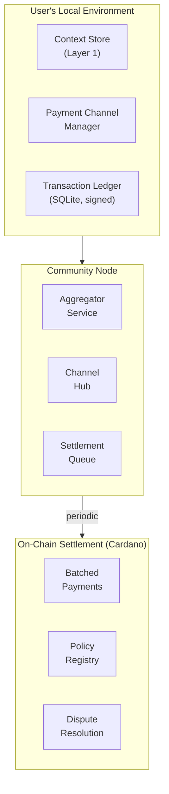

# ADR-002: Transaction Cost Management

**Status:** Proposed
**Date:** 2025-12-18
**Decision:** Use off-chain payment channels with periodic on-chain settlement to minimize transaction costs

## Context

PCI's economic model relies on micropayments (x402 protocol) for data access and proof verification. A naive implementation where every interaction requires an on-chain transaction faces critical problems:

| Concern | Impact |
|---------|--------|
| Transaction fees | ADA fees (~0.17 ADA minimum) can exceed micropayment value ($0.001-0.01) |
| User friction | Constant wallet prompts destroy UX |
| Network load | Millions of users = unsustainable chain bloat |
| Cost volatility | ADA/NIGHT price fluctuations make costs unpredictable |

**Example scenario:** A user reading 100 articles at $0.002 each = $0.20 value. If each requires an on-chain transaction at $0.10 fee, the user pays $10.20 for $0.20 of content. This is economically absurd.

## Decision

**Adopt a tiered transaction model** that keeps routine interactions off-chain while preserving cryptographic guarantees for high-value operations.

### Transaction Tiers

| Tier | Transaction Type | Settlement | On-Chain? |
|------|------------------|------------|-----------|
| **Tier 1** | Routine access (reads, API calls, low-value proofs) | Batched daily/weekly | No |
| **Tier 2** | Accumulated micropayments exceeding threshold | Periodic settlement | Yes |
| **Tier 3** | Policy registration/updates | Immediate | Yes |
| **Tier 4** | Dispute resolution, high-value verification | Immediate | Yes |

### Rationale

1. **"Build WITH chain, not ON chain"** - Core PCI principle. Blockchain provides enforcement anchor, not transaction rail.

2. **Proven patterns exist** - Lightning Network (Bitcoin), state channels (Ethereum), Hydra (Cardano) all demonstrate off-chain scaling.

3. **Community nodes enable batching** - The Community Cloud architecture naturally aggregates transactions across members for efficient settlement.

4. **x402 protocol is transport-agnostic** - HTTP payment headers work regardless of settlement mechanism.

## Architecture

### Off-Chain Components



### Payment Channel Flow

1. **Channel Opening**
   - User deposits funds into a payment channel (on-chain, one-time)
   - Channel state tracked locally with cryptographic signatures
   - Counterparty (service or community node) co-signs state updates

2. **Off-Chain Transactions**
   - Each micropayment updates channel state locally
   - Both parties sign the new balance
   - No on-chain activity required
   - Instant, zero-fee from user perspective

3. **Settlement Triggers**
   - Scheduled: Daily/weekly batch settlement
   - Threshold: When accumulated value exceeds configurable limit (e.g., $5)
   - Channel expiry: Time-locked channels settle automatically
   - Dispute: Either party can force on-chain settlement

4. **Batch Settlement**
   - Community node aggregates member transactions
   - Single on-chain transaction settles multiple users
   - Fee amortized across all participants

### Threshold Configuration

```typescript
interface SettlementPolicy {
  // Minimum accumulated value before triggering settlement
  valueThreshold: number; // e.g., 5.00 (USD equivalent)

  // Maximum time between settlements
  timeThreshold: number; // e.g., 604800000 (7 days in ms)

  // Force immediate on-chain for amounts above this
  immediateThreshold: number; // e.g., 100.00 (USD equivalent)

  // Allow community node to batch (reduces individual fees)
  allowBatching: boolean;
}
```

### Transaction Ledger Schema

Local SQLite table for off-chain transaction tracking:

```sql
CREATE TABLE transactions (
  id TEXT PRIMARY KEY,
  channel_id TEXT NOT NULL,
  counterparty_did TEXT NOT NULL,
  amount_lovelace INTEGER NOT NULL,
  amount_usd_equivalent REAL NOT NULL,
  transaction_type TEXT NOT NULL, -- 'access', 'proof', 'subscription'
  s_pal_policy_id TEXT,
  timestamp INTEGER NOT NULL,
  user_signature TEXT NOT NULL,
  counterparty_signature TEXT NOT NULL,
  settled BOOLEAN DEFAULT FALSE,
  settlement_tx_hash TEXT,

  FOREIGN KEY (channel_id) REFERENCES payment_channels(id)
);

CREATE TABLE payment_channels (
  id TEXT PRIMARY KEY,
  counterparty_did TEXT NOT NULL,
  deposit_tx_hash TEXT NOT NULL,
  total_deposited INTEGER NOT NULL,
  current_balance INTEGER NOT NULL,
  channel_state TEXT NOT NULL, -- 'open', 'closing', 'closed'
  opened_at INTEGER NOT NULL,
  expires_at INTEGER,
  last_activity INTEGER NOT NULL
);
```

## Alternatives Considered

### 1. Hydra (Cardano L2)

**Pros:**
- Native Cardano integration
- High throughput (1000+ TPS per head)
- Full Plutus script support

**Cons:**
- Requires all participants online for head operation
- Complex multi-party coordination
- Still maturing (launched 2023)

**Verdict:** Consider for high-volume service providers, not individual users.

### 2. Pure Prepaid Model

**Pros:**
- Simplest implementation
- User deposits once, draws down locally

**Cons:**
- Requires trust in service provider accounting
- No cryptographic guarantees until settlement
- Disputes harder to resolve

**Verdict:** Acceptable for low-value interactions with trusted community nodes.

### 3. Stablecoin Rails (DJED/USDC)

**Pros:**
- Price stability eliminates volatility concern
- Familiar USD-denominated pricing

**Cons:**
- Additional token complexity
- Regulatory uncertainty
- Still requires on-chain transactions

**Verdict:** Use for pricing/display, but doesn't solve transaction frequency.

## Consequences

### Positive

- Micropayments become economically viable
- User experience dramatically improved (no constant wallet prompts)
- Community nodes provide natural batching infrastructure
- Preserves cryptographic guarantees via signed state
- Scales to millions of users without chain bloat

### Negative

- Implementation complexity increases significantly
- Requires trust in channel counterparty between settlements
- Dispute resolution needs careful design
- Channel liquidity management adds operational overhead
- Users must understand channel deposits (onboarding friction)

### Risks & Mitigations

| Risk | Mitigation |
|------|------------|
| Counterparty disappears before settlement | Time-locked channels auto-settle; user can force close |
| State disagreement | Both signatures required; on-chain arbitration available |
| Channel liquidity exhausted | Automatic top-up prompts; graceful degradation to on-chain |
| Price volatility during channel lifetime | Short channel durations; USD-equivalent thresholds |

## Implementation

### Phase 1: Prepaid Credits (MVP)

1. Implement local transaction ledger (SQLite)
2. Add prepaid credit system at community node level
3. Batch settlements on weekly schedule
4. No payment channels yet - trust community node accounting

### Phase 2: Bilateral Payment Channels

1. Implement two-party payment channel contracts (Plutus)
2. Add channel management to pci-agent
3. Automatic channel lifecycle (open, transact, settle)
4. Dispute resolution via on-chain arbitration

### Phase 3: Channel Networks

1. Explore multi-hop payments (user → community node → service)
2. Evaluate Hydra integration for high-volume scenarios
3. Cross-community settlement optimization

## Open Questions

1. **Channel deposit UX** - How do we make "deposit to open channel" feel natural to non-crypto users?
2. **Offline operation** - How long can a user operate with signed-but-unsettled transactions?
3. **Cross-community payments** - How do channels work when user's community node differs from service's?
4. **Regulatory classification** - Are payment channels considered money transmission?

## References

- [x402 Payment Protocol](https://www.x402.org/)
- [Cardano Hydra](https://hydra.family/)
- [Lightning Network Paper](https://lightning.network/lightning-network-paper.pdf)
- [State Channels Overview](https://ethereum.org/en/developers/docs/scaling/state-channels/)
- [PCI Architecture Overview](./01-architecture-overview.md)
