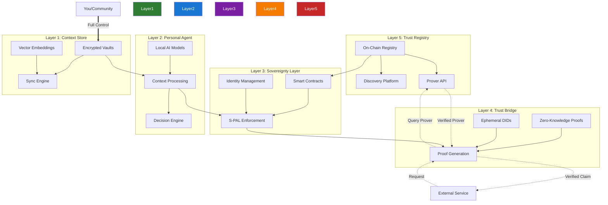
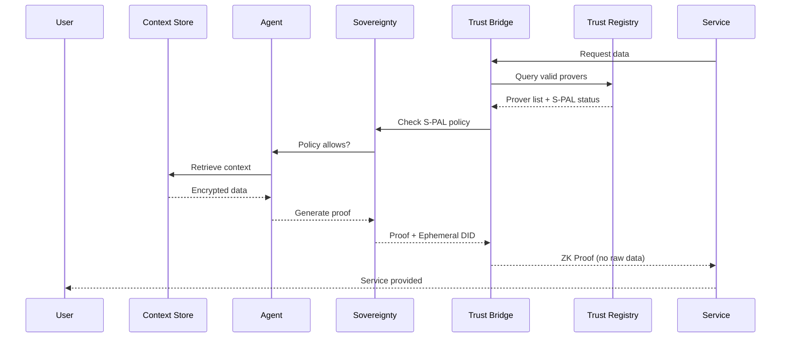
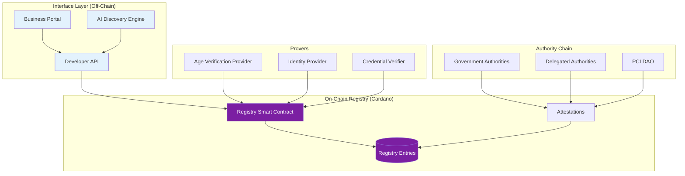
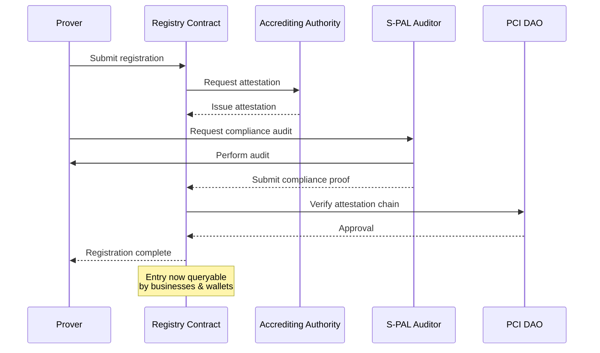
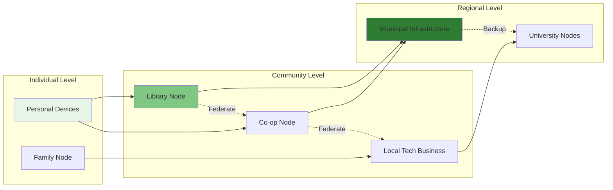
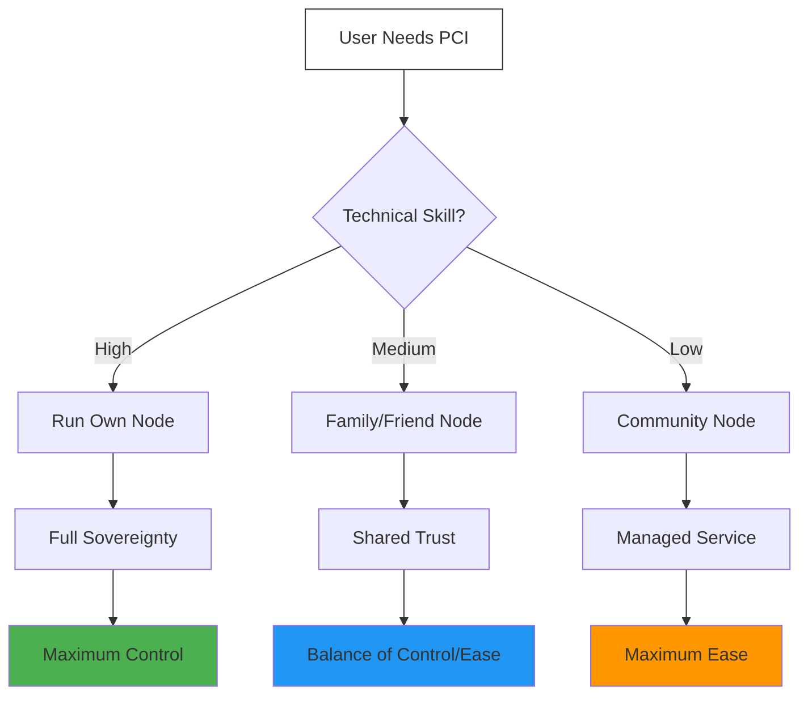
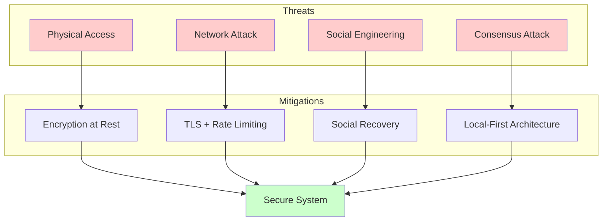
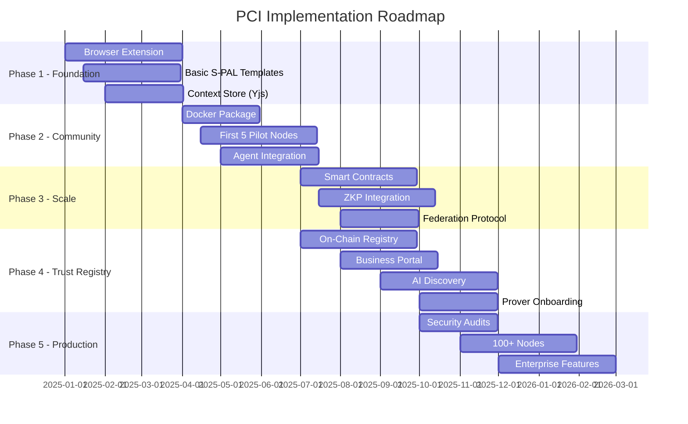

# PCI Architecture Diagrams

## 5-Layer Sovereign Stack (with Trust Registry)

## Data Flow Sequence

## Trust Registry Architecture

## Prover Registration Flow

## Community Cloud Architecture

## Deployment Options

## Security Model

## Implementation Phases

