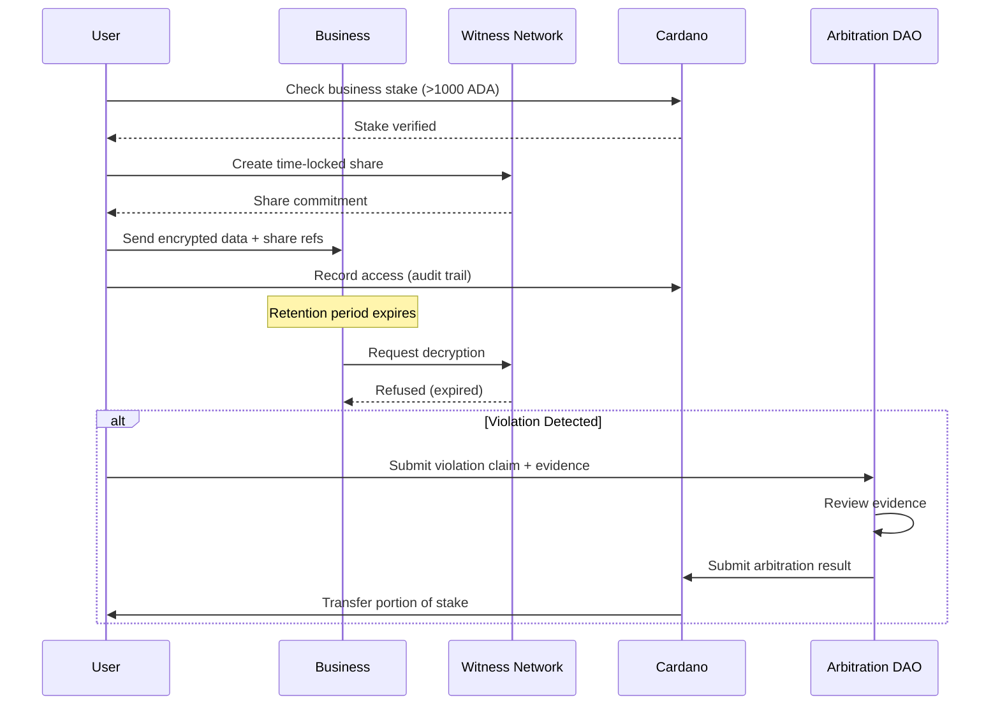

# PCI Technical Implementation Appendix

## Table of Contents
1. [System Architecture](#system-architecture)
2. [Layer 1: Context Store Implementation](#layer-1-context-store)
3. [Layer 2: Personal Agent Implementation](#layer-2-personal-agent)
4. [Layer 3: Sovereignty Layer Implementation](#layer-3-sovereignty-layer)
5. [Layer 4: Trust Bridge Implementation](#layer-4-trust-bridge)
6. [Layer 5: Trust Registry Implementation](#layer-5-trust-registry)
7. [S-PAL Specification](#s-pal-specification)
8. [Community Node Deployment](#community-node-deployment)
9. [Security Considerations](#security-considerations)
   - [Data Retention Enforcement](#data-retention-enforcement)
10. [API Specifications](#api-specifications)

---

## System Architecture

### Core Design Principles
- **Local-First:** Data lives on user/community devices, not cloud
- **Cryptographic Guarantees:** Math enforces privacy, not policies
- **Progressive Enhancement:** Works partially without full stack
- **Federation Ready:** Communities can interconnect

### Technology Stack Overview
```yaml
Layer 1 - Context Store:
  - Primary: Yjs (battle-tested CRDT framework, 1.9M weekly downloads)
  - Vectors: sqlite-vec (embedded vector search)
  - Future: Jazz (when mature - see ADR-001)
  - Encryption: AES-256-GCM at rest
  - Sync: CRDTs for conflict resolution

Layer 2 - Personal Agent:
  - Local Models: Qwen3.6-27B, Phi-4 (14B), Phi-4-mini (3.8B), Bonsai 27B (5.9 GB ternary / 3.9 GB 1-bit, PrismML, Apache 2.0)
  - Runtime: Ollama (default cross-platform), llama.cpp / mistral.rs (substrate), WebAssembly
  - Structured output: XGrammar (vLLM/SGLang) or llama.cpp built-in JSON-schema → GBNF
  - Deployment: Electron app, browser extension, mobile app, llamafile single-executable bundle
  - Community: Docker containers on shared hardware

Layer 3 - Sovereignty Layer:
  - Blockchain: Cardano (Plutus v3)
  - Smart Contracts: Aiken (Rust-like) or Helios (TypeScript-like)
  - Identity: W3C DIDs, Hyperledger Aries
  - Standards: S-PAL (Sovereign Privacy & Access Language)

Layer 4 - Trust Bridge:
  - ZKP Framework: Midnight (Compact language)
  - Circuits: Circom for custom proofs
  - Libraries: snarkjs, libsnark
  - Identity: Ephemeral DIDs per interaction

Layer 5 - Trust Registry:
  - On-Chain: Cardano smart contracts (prover registry)
  - Off-Chain: REST/GraphQL API, Business Portal
  - Discovery: AI-powered classification and recommendation
  - Standards: ToIP TRQP compatible, eIDAS interoperable
```

---

## Layer 1: Context Store

### Data Model
```typescript
interface ContextStore {
  // Core identity
  rootDID: string;
  publicKey: CryptoKey;
  
  // Encrypted vaults
  vaults: {
    personal: EncryptedVault;
    health: EncryptedVault;
    financial: EncryptedVault;
    professional: EncryptedVault;
    custom: Map<string, EncryptedVault>;
  };
  
  // Vector embeddings for semantic search
  embeddings: {
    documents: Float32Array[];
    metadata: EmbeddingMetadata[];
  };
  
  // Sync configuration
  sync: {
    peers: PeerConnection[];
    conflictResolution: CRDTStrategy;
    backupLocations: BackupEndpoint[];
  };
}
```

### Yjs Implementation Example
```typescript
import * as Y from 'yjs';
import { IndexeddbPersistence } from 'y-indexeddb';
import { WebsocketProvider } from 'y-websocket';

class ContextNode {
  private doc: Y.Doc;
  private vaults: Y.Map<Y.Map<unknown>>;
  private persistence: IndexeddbPersistence;
  private syncProvider?: WebsocketProvider;

  constructor(userId: string) {
    this.doc = new Y.Doc();
    this.vaults = this.doc.getMap('vaults');

    // Local persistence (browser)
    this.persistence = new IndexeddbPersistence(`pci-${userId}`, this.doc);
  }

  // Enable sync with self-hosted server
  enableSync(serverUrl: string) {
    this.syncProvider = new WebsocketProvider(serverUrl, 'pci-room', this.doc);
  }

  async addDocument(vaultName: string, doc: Document) {
    let vault = this.vaults.get(vaultName);
    if (!vault) {
      vault = new Y.Map();
      this.vaults.set(vaultName, vault);
    }

    // Generate embedding (via sqlite-vec)
    const embedding = await this.generateEmbedding(doc);

    // Store encrypted content
    vault.set(doc.id, {
      content: await encrypt(doc.content, this.encryptionKey),
      embedding: embedding,
      metadata: doc.metadata,
      updatedAt: Date.now()
    });
  }

  // Observe changes for reactivity
  observe(callback: (events: Y.YEvent<any>[]) => void) {
    this.vaults.observeDeep(callback);
  }
}
```

### Storage Requirements
- **Minimum:** 10GB encrypted storage per user
- **Recommended:** 100GB for full context history
- **Bandwidth:** 10 Mbps for real-time sync
- **Redundancy:** 3x replication across devices/nodes

---

## Layer 2: Personal Agent

### Local SLM Deployment
```python
# Using llama.cpp for efficient inference
import llama_cpp
import numpy as np
from typing import List, Dict

class PersonalAgent:
    def __init__(self, model_path: str):
        self.llm = llama_cpp.Llama(
            model_path=model_path,
            n_ctx=4096,  # Context window
            n_gpu_layers=35,  # GPU acceleration if available
            n_threads=8
        )
        self.context_store = ContextStore()
        
    def process_request(self, request: str, policy: SPALPolicy):
        # Retrieve relevant context
        context = self.context_store.semantic_search(request)
        
        # Check S-PAL policy
        if not policy.allows_access(context):
            return None
            
        # Generate response
        response = self.llm(
            f"Context: {context}\nRequest: {request}",
            max_tokens=512,
            temperature=0.7
        )
        
        # Audit log
        self.log_interaction(request, response, policy)
        
        return response
```

### WASM Agent for Browsers
```typescript
// WebAssembly module for browser-based agents
import init, { PersonalAgent } from './pkg/pci_agent_wasm.js';

async function setupBrowserAgent() {
  await init();

  const agent = new PersonalAgent();

  // Load model (quantized for browser). Phi-4-mini (3.8B) is the browser-tier
  // fallback; laptop/phone tiers use Qwen3.6-27B or Bonsai 27B via Ollama.
  await agent.load_model('phi-4-mini-q4.onnx');

  // Connect to local context store
  await agent.connect_context_store({
    endpoint: 'ws://localhost:8080',
    auth: await generateProof()
  });

  return agent;
}
```

### Community Node Agent Architecture
```yaml
version: '3.8'
services:
  agent-orchestrator:
    image: pci/agent-orchestrator:latest
    ports:
      - "8080:8080"
    volumes:
      - ./models:/models
      - ./contexts:/contexts
    environment:
      - MAX_CONCURRENT_AGENTS=100
      # Community-tier default: Qwen3.6-27B (Q4-class, ~17 GB) served via Ollama.
      # Bonsai-27B 1-bit is the low-RAM fallback once the host runtime picks up
      # mainline llama.cpp's Q1_0 kernels.
      - LLM_BACKEND=ollama
      - LLM_MODEL=qwen3.6:27b
      - LLM_URL=http://ollama:11434
      - COMMUNITY_ID=${COMMUNITY_ID}
    
  load-balancer:
    image: nginx:alpine
    ports:
      - "443:443"
    volumes:
      - ./nginx.conf:/etc/nginx/nginx.conf
    depends_on:
      - agent-orchestrator
```

---

## Layer 3: Sovereignty Layer

### S-PAL Smart Contract (Aiken)
```rust
use aiken/hash.{Blake2b_224, Hash}
use aiken/list
use aiken/transaction.{ScriptContext}

type SPALPolicy {
  owner: Hash<Blake2b_224, VerificationKey>,
  rules: List<AccessRule>,
  version: Int,
}

type AccessRule {
  context_scope: ByteArray,
  identity_requirement: IdentityType,
  retention_limit: Int,  // seconds
  derivative_forbidden: Bool,
  payment_required: Int, // lovelace
}

validator spal_enforcer {
  fn enforce(policy: SPALPolicy, ctx: ScriptContext) -> Bool {
    // Check signature
    let tx = ctx.transaction
    expect Some(signature) = list.find(
      tx.extra_signatories,
      fn(sig) { sig == policy.owner }
    )
    
    // Validate access rules
    expect Some(access_request) = decode_access_request(tx.metadata)
    
    // Check each rule
    list.all(
      policy.rules,
      fn(rule) { validate_rule(rule, access_request) }
    )
  }
}
```

### DID Implementation
```typescript
interface PCI_DID {
  // Root DID (permanent identity)
  root: {
    id: string;  // did:key:z6Mk... (chain-agnostic; pci-identity uses did:key today, Cardano-anchored methods like did:prism are implementation-deferred)
    publicKey: JsonWebKey;
    privateKey: CryptoKey;  // Never leaves device
    created: Date;
  };
  
  // Ephemeral DIDs (single-use)
  ephemeral: {
    generate(): Promise<EphemeralDID>;
    derive(nonce: Uint8Array): EphemeralDID;
    revoke(did: string): void;
  };
}

class DIDManager {
  async createEphemeralDID(purpose: string): Promise<EphemeralDID> {
    const nonce = crypto.getRandomValues(new Uint8Array(32));
    const derived = await this.deriveKey(this.rootKey, nonce);
    
    return {
      id: `did:key:z${base58(derived.public)}`,  // pci-identity ephemeral DID format
      publicKey: derived.public,
      privateKey: derived.private,
      validUntil: Date.now() + 3600000, // 1 hour
      purpose,
      parent: this.rootDID
    };
  }
}
```

---

## Layer 4: Trust Bridge

### Zero-Knowledge Proof Generation (Midnight/Compact)
```typescript
// Compact contract for age verification
contract AgeVerification {
  // Private state (never revealed)
  @shielded birthDate: Date;
  @shielded documentHash: Bytes32;
  
  // Public state (visible on-chain)
  @transparent verificationCount: Integer;
  
  // Circuit: Prove age without revealing birthdate
  circuit proveOver18(currentDate: Date): Boolean {
    assert(currentDate.year - this.birthDate.year >= 18);
    this.verificationCount += 1;
    return true;
  }
  
  // Generate proof for external verification
  export function generateAgeProof(minAge: number): Proof {
    const proof = await generateProof({
      circuit: 'proveOver18',
      private_inputs: {
        birthDate: this.birthDate
      },
      public_inputs: {
        currentDate: new Date(),
        minAge: minAge
      }
    });
    
    return {
      proof: proof.serialize(),
      publicSignals: proof.publicSignals,
      verificationKey: this.verificationKey
    };
  }
}
```

### Proof Caching System
```python
class ProofCache:
    def __init__(self, storage_path: str):
        self.cache = {}
        self.storage = LevelDB(storage_path)
        
    async def get_or_generate(self, claim: Claim) -> Proof:
        # Check cache
        cache_key = self.compute_cache_key(claim)
        
        if cached := self.cache.get(cache_key):
            if not cached.is_expired():
                return cached
                
        # Check persistent storage
        if stored := await self.storage.get(cache_key):
            if not stored.is_expired():
                self.cache[cache_key] = stored
                return stored
                
        # Generate new proof
        proof = await self.generate_proof(claim)
        
        # Cache with appropriate TTL
        ttl = self.compute_ttl(claim)
        self.cache[cache_key] = CachedProof(proof, ttl)
        await self.storage.put(cache_key, proof)
        
        return proof
```

---

## Layer 5: Trust Registry

### Overview
The Trust Registry is a blockchain-anchored directory of approved proof providers (provers), with off-chain discovery platforms for business usability. It answers the question: "Which provers can I trust for this type of verification in this jurisdiction?"

### On-Chain Registry Contract (Aiken)
```rust
use aiken/hash.{Blake2b_224, Hash}
use aiken/list
use aiken/transaction.{ScriptContext, Output}

type ProverEntry {
  prover_did: ByteArray,
  legal_name: ByteArray,
  proof_types: List<ProofType>,
  jurisdictions: List<ByteArray>,
  accrediting_authority: AccreditingAuthority,
  spal_compliance: SPALCompliance,
  status: ProverStatus,
  metadata_uri: ByteArray,
  registered_at: Int,
  updated_at: Int,
}

type ProofType {
  category: ByteArray,
  specific_type: ByteArray,
  zkp_supported: Bool,
}

type AccreditingAuthority {
  authority_type: AuthorityType,
  authority_did: ByteArray,
  attestation_tx: ByteArray,
}

type AuthorityType {
  Government
  Delegated
  DAO
}

type SPALCompliance {
  version: ByteArray,
  attestation_hash: ByteArray,
  auditor_did: ByteArray,
  last_audit: Int,
}

type ProverStatus {
  Pending
  Active
  Suspended
  Revoked
}

validator trust_registry {
  fn register_prover(
    entry: ProverEntry,
    authority_sig: ByteArray,
    ctx: ScriptContext
  ) -> Bool {
    // Verify accrediting authority signature
    let authority_valid = verify_authority_signature(
      entry.accrediting_authority,
      authority_sig,
      ctx
    )
    
    // Verify S-PAL compliance attestation
    let spal_valid = verify_spal_attestation(
      entry.spal_compliance,
      ctx
    )
    
    // Verify unique DID
    let did_unique = !prover_exists(entry.prover_did, ctx)
    
    authority_valid && spal_valid && did_unique
  }
  
  fn update_status(
    prover_did: ByteArray,
    new_status: ProverStatus,
    authority_sig: ByteArray,
    ctx: ScriptContext
  ) -> Bool {
    // Only original accrediting authority can update status
    let entry = get_prover_entry(prover_did, ctx)
    verify_authority_signature(
      entry.accrediting_authority,
      authority_sig,
      ctx
    )
  }
  
  fn query_provers(
    proof_type: ByteArray,
    jurisdiction: ByteArray,
    ctx: ScriptContext
  ) -> List<ProverEntry> {
    // Return all active provers matching criteria
    list.filter(
      get_all_provers(ctx),
      fn(entry) {
        entry.status == Active &&
        list.any(entry.proof_types, fn(pt) { pt.category == proof_type }) &&
        list.any(entry.jurisdictions, fn(j) { j == jurisdiction })
      }
    )
  }
}
```

### TypeScript Data Models
```typescript
interface ProverRegistryEntry {
  // Identity
  prover_did: string;
  legal_name: string;
  
  // Capabilities
  proof_types: ProofType[];
  jurisdictions: Jurisdiction[];
  
  // Trust Chain
  accrediting_authority: {
    type: 'government' | 'delegated' | 'dao';
    did: string;
    attestation_tx: string;
  };
  
  // S-PAL Compliance
  spal_compliance: {
    version: string;
    attestation_hash: string;
    auditor_did: string;
    last_audit: Date;
  };
  
  // Status
  status: 'pending' | 'active' | 'suspended' | 'revoked';
  status_reason?: string;
  
  // Metadata
  metadata_uri: string;  // IPFS URI
  
  // Timestamps
  registered: Date;
  last_updated: Date;
}

interface ProofType {
  category: string;        // e.g., "identity", "age", "credentials"
  specific_type: string;   // e.g., "over_18", "degree_verified"
  zkp_supported: boolean;
  spal_template_id?: string;
}

interface Jurisdiction {
  country_code: string;    // ISO 3166-1 alpha-2
  region?: string;
  regulatory_framework?: string;  // e.g., "GDPR", "CCPA", "eIDAS"
}
```

### Off-Chain Discovery API
```typescript
class TrustRegistryAPI {
  private cardanoClient: CardanoClient;
  private cache: ProverCache;
  
  constructor(config: RegistryConfig) {
    this.cardanoClient = new CardanoClient(config.networkId);
    this.cache = new ProverCache(config.cacheTTL);
  }
  
  /**
   * Query provers by criteria
   */
  async queryProvers(query: ProverQuery): Promise<ProverEntry[]> {
    // Check cache first
    const cacheKey = this.computeCacheKey(query);
    if (this.cache.has(cacheKey)) {
      return this.cache.get(cacheKey);
    }
    
    // Query on-chain registry
    const entries = await this.cardanoClient.queryRegistry({
      proof_type: query.proofType,
      jurisdiction: query.jurisdiction,
      spal_compliant: query.spalCompliant ?? true,
      status: 'active'
    });
    
    // Enrich with off-chain metadata
    const enriched = await Promise.all(
      entries.map(e => this.enrichWithMetadata(e))
    );
    
    // Cache and return
    this.cache.set(cacheKey, enriched);
    return enriched;
  }
  
  /**
   * Verify a prover's current status and compliance
   */
  async verifyProver(
    proverDid: string,
    proofType: string,
    policyHash?: string
  ): Promise<VerificationResult> {
    const entry = await this.cardanoClient.getProverEntry(proverDid);
    
    if (!entry) {
      return { valid: false, reason: 'Prover not found' };
    }
    
    if (entry.status !== 'active') {
      return { valid: false, reason: `Prover status: ${entry.status}` };
    }
    
    const supportsType = entry.proof_types.some(
      pt => pt.category === proofType || pt.specific_type === proofType
    );
    
    if (!supportsType) {
      return { valid: false, reason: 'Prover does not support requested proof type' };
    }
    
    // Verify S-PAL compliance if policy provided
    if (policyHash) {
      const compliant = await this.verifySPALCompliance(
        entry.spal_compliance,
        policyHash
      );
      if (!compliant) {
        return { valid: false, reason: 'Prover not compliant with specified S-PAL policy' };
      }
    }
    
    return {
      valid: true,
      entry: entry,
      trust_chain: await this.resolveTrustChain(entry.accrediting_authority)
    };
  }
  
  /**
   * AI-powered prover recommendation
   */
  async recommendProvers(
    requirements: BusinessRequirements
  ): Promise<ProverRecommendation[]> {
    // Get all matching provers
    const candidates = await this.queryProvers({
      proofType: requirements.proofType,
      jurisdiction: requirements.jurisdiction,
      spalCompliant: true
    });
    
    // Score and rank based on requirements
    const scored = candidates.map(prover => ({
      prover,
      score: this.computeScore(prover, requirements)
    }));
    
    // Sort by score and return top recommendations
    scored.sort((a, b) => b.score - a.score);
    
    return scored.slice(0, requirements.maxResults ?? 5).map(s => ({
      prover: s.prover,
      score: s.score,
      reasons: this.explainScore(s.prover, requirements)
    }));
  }
  
  private computeScore(
    prover: ProverEntry,
    requirements: BusinessRequirements
  ): number {
    let score = 0;
    
    // S-PAL compliance version match
    if (prover.spal_compliance.version === requirements.spalVersion) {
      score += 30;
    }
    
    // ZKP support bonus
    if (prover.proof_types.some(pt => pt.zkp_supported)) {
      score += 20;
    }
    
    // Regulatory framework alignment
    const frameworks = requirements.regulatoryFrameworks ?? [];
    const matches = prover.jurisdictions.filter(
      j => j.regulatory_framework && frameworks.includes(j.regulatory_framework)
    );
    score += matches.length * 10;
    
    // Recent audit bonus
    const auditAge = Date.now() - prover.spal_compliance.last_audit.getTime();
    const monthsOld = auditAge / (1000 * 60 * 60 * 24 * 30);
    if (monthsOld < 3) score += 15;
    else if (monthsOld < 6) score += 10;
    else if (monthsOld < 12) score += 5;
    
    return score;
  }
}
```

### Trust Chain Resolution
```typescript
interface TrustChain {
  prover: ProverEntry;
  delegated_authority?: AuthorityEntry;
  root_authority: AuthorityEntry;
  pci_dao_recognition: DAORecognition;
}

class TrustChainResolver {
  async resolve(prover: ProverEntry): Promise<TrustChain> {
    const { accrediting_authority } = prover;
    
    let delegated: AuthorityEntry | undefined;
    let root: AuthorityEntry;
    
    if (accrediting_authority.type === 'delegated') {
      // Resolve delegated authority
      delegated = await this.getAuthority(accrediting_authority.did);
      
      // Follow chain to root
      root = await this.getAuthority(delegated.parent_authority_did);
    } else if (accrediting_authority.type === 'government') {
      root = await this.getAuthority(accrediting_authority.did);
    } else {
      // DAO-issued credential
      root = await this.getDAOAuthority();
    }
    
    // Verify PCI DAO recognition
    const daoRecognition = await this.verifyDAORecognition(root.did);
    
    return {
      prover,
      delegated_authority: delegated,
      root_authority: root,
      pci_dao_recognition: daoRecognition
    };
  }
}
```

---

## S-PAL Specification

### S-PAL Document Structure (Version 1.0)

**Multi-Context Identity Support:** S-PAL recognizes that users have different identities across platforms and contexts. Your context in a work Slack differs from your context in a family WhatsApp. The `persona` field allows policies to be scoped to specific identity contexts while maintaining unified control.

```json
{
  "$schema": "https://pci.community/spal/v1.0/schema.json",
  "version": "1.0",
  "id": "spal:did:key:z6Mk...:health-records",
  "name": "Health Records Access Policy",
  "created": "2025-01-01T00:00:00Z",
  "owner": "did:key:z6MkhaXgBZDvotDkL5257faiztiGiC2QtKLGpbnnEGta2doK",

  "rules": [
    {
      "id": "rule-1",
      "context_scope": "medical/diagnosis_codes",
      "persona": {
        "type": "personal",
        "platforms": ["health.gov", "doctor-portal.com"],
        "description": "Personal health identity - not shared with employer"
      },
      "conditions": {
        "identity": {
          "type": "ephemeral_required",
          "linkage": "forbidden"
        },
        "proofs": [
          {
            "type": "zkp",
            "claim": "has_condition",
            "params": {
              "condition": "allergies",
              "result": false
            }
          }
        ],
        "retention": {
          "max_seconds": 0,
          "audit_log": true
        },
        "derivatives": {
          "training": "forbidden",
          "aggregation": "forbidden",
          "resale": "forbidden"
        }
      },
      "payment": {
        "protocol": "x402",
        "amount": 1000,
        "currency": "sats"
      }
    }
  ],
  
  "enforcement": {
    "smart_contract": "addr1_contract_...",
    "validators": ["cardano", "midnight"],
    "dispute_resolution": "dao:pci:health"
  },
  
  "signature": "..."
}
```

### Persona Types

S-PAL supports multiple persona types to reflect the natural complexity of human identity across different contexts:

| Persona Type | Description | Example Use Cases |
|--------------|-------------|-------------------|
| `personal` | Private individual context | Health records, family photos, personal finances |
| `professional` | Work-related identity | LinkedIn, employer systems, professional credentials |
| `public` | Intentionally public persona | Social media, blog, public portfolio |
| `anonymous` | Unlinkable interactions | Whistleblowing, sensitive research, activism |
| `pseudonymous` | Consistent but not linked to real identity | Gaming, online communities |
| `family` | Shared family context | Family calendar, shared photos, household accounts |
| `community` | Local/affinity group context | Neighborhood apps, club memberships |

**Key Design Principle:** Users maintain unified control over all personas from a single interface, but can set different policies for each. A policy for your `professional` persona might allow LinkedIn to verify employment, while your `personal` persona blocks all such requests.

### S-PAL Negotiation Protocol
```typescript
class SPALNegotiator {
  async negotiate(
    serviceRequest: ServiceRequest,
    userPolicy: SPALPolicy
  ): Promise<NegotiationResult> {
    
    // Step 1: Service presents requirements
    const requirements = serviceRequest.getRequirements();
    
    // Step 2: Check compatibility
    const conflicts = this.findConflicts(requirements, userPolicy);
    
    if (conflicts.length === 0) {
      // Full compatibility
      return {
        status: 'accepted',
        policy: userPolicy,
        proofs: await this.generateProofs(requirements)
      };
    }
    
    // Step 3: Attempt resolution
    const alternatives = this.suggestAlternatives(conflicts);
    
    if (alternatives.length > 0) {
      // Partial compatibility possible
      return {
        status: 'negotiable',
        alternatives: alternatives,
        conflicts: conflicts
      };
    }
    
    // Step 4: Rejection
    return {
      status: 'rejected',
      reason: 'Incompatible requirements',
      conflicts: conflicts
    };
  }
}
```

---

## Community Node Deployment

### Hardware Requirements
```yaml
Minimum (50-100 users):
  cpu: 4 cores (ARM64 or x86_64)
  ram: 16GB
  storage: 1TB NVMe SSD
  network: 100 Mbps symmetric
  example: Raspberry Pi 5 cluster (4 nodes)
  cost: ~$500

Recommended (100-500 users):
  cpu: 8 cores
  ram: 32GB
  storage: 4TB NVMe RAID 1
  network: 1 Gbps
  example: Refurbished Dell R740
  cost: ~$2000

Scale (500+ users):
  cpu: 16+ cores
  ram: 64GB+
  storage: 10TB+ distributed
  network: 10 Gbps
  example: Commodity cluster (3+ nodes)
  cost: ~$10000
```

### One-Click Deployment Script
```bash
#!/bin/bash
# PCI Community Node Installer

echo "🚀 PCI Community Node Setup"

# Check system requirements
check_requirements() {
  RAM=$(free -m | awk '/^Mem:/{print $2}')
  CORES=$(nproc)
  
  if [ $RAM -lt 16000 ]; then
    echo "⚠️  Warning: Less than 16GB RAM detected"
  fi
  
  if [ $CORES -lt 4 ]; then
    echo "⚠️  Warning: Less than 4 CPU cores detected"
  fi
}

# Install dependencies
install_deps() {
  curl -fsSL https://get.docker.com | sh
  curl -L https://github.com/docker/compose/releases/latest/download/docker-compose-$(uname -s)-$(uname -m) -o /usr/local/bin/docker-compose
  chmod +x /usr/local/bin/docker-compose
}

# Deploy stack
deploy() {
  git clone https://github.com/pci-community/node-template
  cd node-template
  
  # Generate keys
  ./scripts/generate-keys.sh
  
  # Configure
  cp .env.example .env
  echo "Please edit .env with your community details"
  nano .env
  
  # Launch
  docker-compose up -d
  
  echo "✅ Node deployed!"
  echo "🌐 Dashboard: https://localhost:8443"
  echo "📚 Docs: https://pci.community/docs"
}

check_requirements
install_deps
deploy
```

### Monitoring Stack
```yaml
version: '3.8'
services:
  prometheus:
    image: prom/prometheus
    volumes:
      - ./prometheus.yml:/etc/prometheus/prometheus.yml
    ports:
      - "9090:9090"
      
  grafana:
    image: grafana/grafana
    ports:
      - "3000:3000"
    environment:
      - GF_SECURITY_ADMIN_PASSWORD=${ADMIN_PASSWORD}
    volumes:
      - grafana-storage:/var/lib/grafana
      
  node-exporter:
    image: prom/node-exporter
    ports:
      - "9100:9100"
    volumes:
      - /proc:/host/proc:ro
      - /sys:/host/sys:ro
      - /:/rootfs:ro
```

---

## Security Considerations

### Threat Model
```yaml
Threats:
  physical_access:
    risk: Medium
    mitigation:
      - Full disk encryption (LUKS)
      - Secure boot
      - TPM attestation
      - Multi-party key sharding
      
  network_attacks:
    risk: High
    mitigation:
      - TLS 1.3 minimum
      - Certificate pinning
      - DDoS protection (Cloudflare proxy)
      - Rate limiting per DID
      
  social_engineering:
    risk: High
    mitigation:
      - Multi-factor authentication
      - Social recovery (Shamir's Secret Sharing)
      - Time-locked operations
      - Community verification for high-value transactions
      
  consensus_attacks:
    risk: Low
    mitigation:
      - Multiple blockchain validators
      - Proof caching to reduce on-chain ops
      - Local-first architecture (blockchain failure doesn't break system)
```

### Cryptographic Standards
```yaml
Encryption:
  at_rest: AES-256-GCM
  in_transit: TLS 1.3 with PFS
  key_derivation: Argon2id
  signatures: Ed25519
  
Zero-Knowledge:
  proving_system: Groth16
  curves: BLS12-381
  trusted_setup: Powers of Tau ceremony
  
Blockchain:
  consensus: Ouroboros Praos (Cardano)
  finality: 30 confirmations
  rollback_protection: 2160 blocks
```

### Data Retention Enforcement

A critical challenge in S-PAL is enforcing "no retention" policies when data must be shared with businesses for verification. While ZK proofs prevent raw data disclosure, businesses may still receive derived information. PCI employs multiple enforcement mechanisms:

#### 1. Cryptographic Time-Locks

Data is encrypted with time-locked keys that automatically expire:

```typescript
interface TimeLockEncryption {
  // Data is encrypted with a key that expires
  encryptWithExpiry(
    data: Buffer,
    expiresAt: Date,
    witnesses: string[]  // Threshold of witnesses required
  ): Promise<TimeLockCiphertext>;

  // Decryption fails after expiry
  decrypt(
    ciphertext: TimeLockCiphertext,
    currentTime: Date
  ): Promise<Buffer | null>;
}

class TimeLockService {
  async shareWithExpiry(
    data: Buffer,
    recipient: string,
    retentionSeconds: number
  ): Promise<TimeLockShare> {
    const expiresAt = new Date(Date.now() + retentionSeconds * 1000);

    // Use threshold encryption with time-release witnesses
    const ciphertext = await this.timelock.encryptWithExpiry(
      data,
      expiresAt,
      await this.getWitnessNetwork()
    );

    // Record on-chain for audit
    await this.recordShareEvent(recipient, expiresAt);

    return { ciphertext, expiresAt, recipient };
  }
}
```

#### 2. On-Chain Audit Trails

All data access events are recorded on Cardano for transparency and dispute resolution:

```rust
// Aiken: Audit trail contract
type AccessRecord {
  requester_did: ByteArray,
  data_hash: ByteArray,  // Hash of accessed data (not the data itself)
  policy_hash: ByteArray,
  retention_claim: Int,  // Seconds claimed
  timestamp: Int,
  signature: ByteArray,
}

validator audit_trail {
  fn record_access(record: AccessRecord, ctx: ScriptContext) -> Bool {
    // Verify requester signed the retention commitment
    verify_signature(record.requester_did, record.signature, ctx) &&
    // Record is within valid time window
    record.timestamp <= get_current_time(ctx) &&
    record.timestamp >= get_current_time(ctx) - 300  // 5 min tolerance
  }

  fn query_access_history(
    data_owner_did: ByteArray,
    ctx: ScriptContext
  ) -> List<AccessRecord> {
    // Returns all access records for dispute resolution
    get_records_by_owner(data_owner_did, ctx)
  }
}
```

#### 3. Threshold Decryption with Community Witnesses

Shared data requires M-of-N community witnesses for decryption, preventing unilateral retention:

```python
class ThresholdDecryption:
    def __init__(self, threshold: int, witnesses: List[str]):
        self.threshold = threshold
        self.witnesses = witnesses

    async def encrypt_for_sharing(
        self,
        data: bytes,
        retention_policy: RetentionPolicy
    ) -> ThresholdCiphertext:
        # Split key into shares
        key = os.urandom(32)
        shares = shamir_split(key, self.threshold, len(self.witnesses))

        # Encrypt data with key
        ciphertext = aes_gcm_encrypt(data, key)

        # Distribute shares to witnesses with expiry
        distributed = await self.distribute_shares(
            shares,
            retention_policy.expires_at
        )

        return ThresholdCiphertext(
            ciphertext=ciphertext,
            share_commitments=distributed,
            expires_at=retention_policy.expires_at
        )

    async def request_decryption(
        self,
        ciphertext: ThresholdCiphertext
    ) -> bytes | None:
        # Check if expired
        if datetime.now() > ciphertext.expires_at:
            # Witnesses will refuse to provide shares
            return None

        # Collect shares from witnesses
        shares = await self.collect_shares(
            ciphertext.share_commitments,
            self.threshold
        )

        # Reconstruct key and decrypt
        key = shamir_combine(shares)
        return aes_gcm_decrypt(ciphertext.ciphertext, key)
```

#### 4. Economic Incentives (Stake Collateral)

Businesses stake collateral that can be slashed for retention violations:

```rust
// Aiken: Collateral staking contract
type BusinessStake {
  business_did: ByteArray,
  collateral_utxo: OutputReference,
  collateral_amount: Int,  // Lovelace staked
  spal_commitment: ByteArray,  // Hash of S-PAL policy
  registered_at: Int,
}

type RetentionViolationClaim {
  claimant_did: ByteArray,
  business_did: ByteArray,
  access_record_tx: ByteArray,  // Reference to audit trail
  evidence_hash: ByteArray,
  claimed_violation_time: Int,
}

validator collateral_manager {
  fn stake_collateral(
    stake: BusinessStake,
    ctx: ScriptContext
  ) -> Bool {
    // Minimum stake: 1000 ADA
    stake.collateral_amount >= 1_000_000_000 &&
    // Business signed commitment
    verify_business_signature(stake, ctx)
  }

  fn claim_violation(
    claim: RetentionViolationClaim,
    arbitration_result: ArbitrationResult,
    ctx: ScriptContext
  ) -> Bool {
    // Must have DAO arbitration approval
    arbitration_result.approved &&
    arbitration_result.arbiter_signatures >= 3 &&
    // Transfer portion of stake to claimant
    outputs_contain_payment(
      ctx,
      claim.claimant_did,
      arbitration_result.award_amount
    )
  }

  fn withdraw_stake(
    business_did: ByteArray,
    ctx: ScriptContext
  ) -> Bool {
    // Can only withdraw if no pending claims
    // and minimum lock period (90 days) elapsed
    no_pending_claims(business_did, ctx) &&
    lock_period_elapsed(business_did, ctx)
  }
}
```

#### 5. Retention Enforcement Flow



#### 6. Graduated Trust Levels

Businesses earn trust through compliance history:

```typescript
interface TrustLevel {
  level: 'new' | 'established' | 'trusted' | 'verified';

  // Requirements by level
  requirements: {
    new: {
      min_stake: 1000,        // ADA
      max_retention: 0,       // No retention
      witness_threshold: 5,   // High threshold
    },
    established: {
      min_stake: 500,
      max_retention: 3600,    // 1 hour
      witness_threshold: 3,
    },
    trusted: {
      min_stake: 100,
      max_retention: 86400,   // 24 hours
      witness_threshold: 2,
    },
    verified: {
      min_stake: 50,
      max_retention: 604800,  // 7 days (with audit)
      witness_threshold: 1,
    },
  };

  // Level is determined by on-chain history
  computeLevel(history: ComplianceHistory): TrustLevel;
}
```

### Audit Logging
```python
class AuditLogger:
    def __init__(self, community_id: str):
        self.community_id = community_id
        self.log_store = TamperProofLog()
        
    def log_access(self, event: AccessEvent):
        entry = {
            'timestamp': time.time(),
            'did': event.ephemeral_did,
            'action': event.action,
            'resource': hash(event.resource),
            'policy': event.policy_hash,
            'result': event.result,
            'proof': event.generate_proof()
        }
        
        # Sign entry
        signature = self.sign(entry)
        
        # Store with merkle proof
        self.log_store.append(entry, signature)
        
        # Periodic checkpoint to blockchain
        if self.should_checkpoint():
            self.checkpoint_to_chain()
```

---

## API Specifications

### Agent API (REST)
```yaml
openapi: 3.0.0
info:
  title: PCI Personal Agent API
  version: 1.0.0
  
paths:
  /agent/query:
    post:
      summary: Query personal agent with context
      requestBody:
        required: true
        content:
          application/json:
            schema:
              type: object
              properties:
                query:
                  type: string
                policy_id:
                  type: string
                proof_requirements:
                  type: array
                  items:
                    $ref: '#/components/schemas/ProofRequirement'
      responses:
        200:
          description: Successful response with proofs
          content:
            application/json:
              schema:
                type: object
                properties:
                  response:
                    type: string
                  proofs:
                    type: array
                    items:
                      $ref: '#/components/schemas/Proof'
                  ephemeral_did:
                    type: string
```

### S-PAL Negotiation API (WebSocket)
```typescript
interface SPALWebSocket {
  // Client -> Server
  onConnect(auth: {
    did: string;
    signature: string;
    timestamp: number;
  }): void;
  
  onPolicyProposal(policy: SPALPolicy): void;
  
  onProofSubmission(proofs: Proof[]): void;
  
  // Server -> Client
  onRequirementsRequest(requirements: ServiceRequirements): void;
  
  onNegotiationResult(result: {
    status: 'accepted' | 'rejected' | 'negotiable';
    conflicts?: Conflict[];
    alternatives?: SPALPolicy[];
  }): void;
  
  onSessionEstablished(session: {
    id: string;
    validUntil: Date;
    capabilities: string[];
  }): void;
}
```

### Community Federation Protocol
```protobuf
syntax = "proto3";

service CommunityFederation {
  rpc RegisterPeer(PeerRegistration) returns (PeerCredentials);
  rpc ShareProof(ProofShareRequest) returns (ProofShareResponse);
  rpc RequestBackup(BackupRequest) returns (BackupResponse);
  rpc VerifyNode(NodeVerification) returns (AttestationResult);
}

message PeerRegistration {
  string community_id = 1;
  string did = 2;
  bytes public_key = 3;
  repeated string capabilities = 4;
  string endpoint = 5;
}

message ProofShareRequest {
  string proof_hash = 1;
  string requester_did = 2;
  bytes signature = 3;
  int64 ttl = 4;
}
```

---

## Implementation Timeline

### Phase 1: MVP (Months 1-3)
- [ ] Browser extension with basic DID management
- [ ] Local context store (Yjs integration)
- [ ] Simple S-PAL templates
- [ ] Basic proof generation (age, location)

### Phase 2: Community Nodes (Months 4-6)
- [ ] Docker deployment package
- [ ] Community node management dashboard
- [ ] Agent orchestration
- [ ] Federation protocol v1

### Phase 3: Scale (Months 7-12)
- [ ] Cardano smart contract deployment
- [ ] Midnight integration
- [ ] Proof markets
- [ ] 100+ node network

### Phase 4: Production (Months 13-18)
- [ ] Security audits
- [ ] Performance optimization
- [ ] Enterprise integration
- [ ] Regulatory compliance tools

---

## Resources

### Documentation
- Main Specification: https://pci.community/spec
- S-PAL Standard: https://pci.community/spal
- API Reference: https://pci.community/api
- Community Guides: https://pci.community/guides

### Code Repositories
- Core Libraries: https://github.com/pci-community/core
- Node Software: https://github.com/pci-community/node
- Browser Extension: https://github.com/pci-community/extension
- Mobile Apps: https://github.com/pci-community/mobile

### Community
- Discord: https://discord.gg/pci
- Forum: https://forum.pci.community
- Working Groups: https://pci.community/wg

### Getting Help
- Setup Support: support@pci.community
- Security: security@pci.community
- Partnerships: partners@pci.community

---

*This is a living document. Latest version at https://pci.community/technical-appendix*
