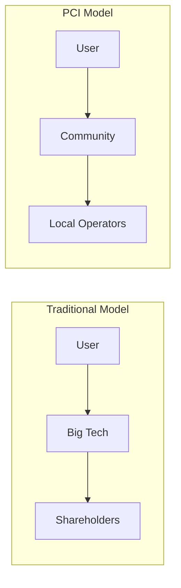

# Personal Context Infrastructure: A Technical Proposal for Data Sovereignty

## Abstract

Current digital infrastructure operates on a context economy model where user data serves as the primary commodity. We propose Personal Context Infrastructure (PCI) - a five-layer architectural stack that maintains user data sovereignty through local-first storage, cryptographic policy enforcement, and zero-knowledge verification. Building on existing technologies and proven community governance models, PCI offers a viable path to digital autonomy without sacrificing functionality.

## 1. Problem Statement

### 1.1 The Current State
The digital economy has evolved into a $2 trillion context economy where:
- User data trains AI models without compensation or consent
- Privacy policies provide legal coverage, not actual privacy
- Users lack meaningful control over their digital footprints
- Data breaches affect billions with minimal accountability
- Context aggregation (like credit scores) becomes a gatekeeper to services, excluding those without digital histories

### 1.2 The Context Economy
As articulated at MozFest 2025, we're witnessing a mass aggregation of personal context by tech giants and AI labs. Context goes beyond raw data—it's dynamic, situational, and relational. Your context in a work Slack differs entirely from your context in a family WhatsApp. Identity isn't fixed; it's performed differently across platforms and relationships.

The stakes are existential: "The most critical piece of this generation of the Internet isn't compute or how good a model is, but it's who has access to one's context." In an agentic internet where AI systems act on our behalf, context becomes currency—and whoever controls that currency controls the future of human-machine interaction.

### 1.3 Technical Limitations of Current Approaches
- **Centralized Storage:** Single points of failure and control
- **Policy-Based Security:** Relies on trust rather than cryptographic guarantees
- **All-or-Nothing Access:** Services demand complete data access
- **Economic Misalignment:** "Free" services funded by data exploitation

## 2. Proposed Solution: Personal Context Infrastructure

### 2.1 Core Innovation
PCI introduces a paradigm shift from centralized data custody to distributed sovereignty through:
- **Local-First Architecture:** Data remains on user/community-controlled devices
- **Cryptographic Enforcement:** Mathematical guarantees replace policy promises
- **Selective Disclosure:** Zero-knowledge proofs enable functionality without exposure
- **Community Infrastructure:** Shared resources make sovereignty accessible

### 2.2 Technical Architecture

The PCI stack consists of five integrated layers:

#### Layer 1: Context Store
- **Purpose:** Secure, synchronized personal data storage
- **Implementation:** Yjs (CRDT-based), sqlite-vec (vectors)
- **Features:** End-to-end encryption, device sync, vector embeddings for semantic search

#### Layer 2: Personal Agent
- **Purpose:** Local AI processing without data leakage
- **Runtime:** Ollama is the default cross-platform host (MLX on Apple Silicon, CUDA/ROCm/Vulkan on Linux, DirectML on Windows); llama.cpp is the underlying substrate, with a WASM path for browser deployment
- **Models:** Qwen3.6-27B (Q4-class, ~17 GB) sets the developer/laptop baseline. Phi-4 (14B) and Phi-4-mini (3.8B) handle smaller RAM envelopes. Bonsai 27B — a Qwen3.6-27B distillation released under Apache 2.0 — brings the same 27B-class behaviour into a 3.9 GB 1-bit build that runs on a phone via kernels merged into mainline llama.cpp, or a 5.9 GB ternary build via PrismML's runtime
- **Structured output:** JSON-schema → GBNF is a shipping feature of both Ollama (`format` field) and llama.cpp, so tool calls and S-PAL request shapes are constrained at generation time rather than parsed defensively afterwards
- **Speech:** Mistral Voxtral (4B, Apache 2.0), NVIDIA Nemotron (600M, streaming)
- **Deployment:** Device-native, community-hosted, or bundled as a single executable via llamafile
- **Capabilities:** Context-aware retrieval, deterministic tool invocation, S-PAL context synthesis, voice input, and — via Bonsai's 4-bit vision tower — on-device image understanding

#### Layer 3: Sovereignty Layer
- **Purpose:** Cryptographic enforcement of privacy preferences
- **Implementation:** Smart contracts on Cardano using TypeScript-friendly languages
- **Languages:**
  - **Helios:** TypeScript-like syntax for accessibility
  - **plu-ts:** Native TypeScript for Cardano
  - **Aiken:** For those comfortable with Rust
- **Standards:** S-PAL (Sovereign Privacy & Access Language)
- **Multi-Context Identity:** S-PAL supports persona-specific policies, recognizing that users have different identities across platforms (work, family, public) while maintaining unified control

#### Layer 4: Trust Bridge
- **Purpose:** Verification without revelation
- **Implementation:** Midnight (Compact language with TypeScript SDK)
- **Features:** Zero-knowledge proofs, ephemeral identities, selective disclosure

#### Layer 5: Trust Registry
- **Purpose:** Discoverable directory of approved proof providers
- **Implementation:** On-chain registry (Cardano) + off-chain discovery platforms
- **Features:** Prover discovery, S-PAL compliance verification, AI-powered recommendations
- **Standards:** Compatible with ToIP TRQP, eIDAS Trusted Lists

## 3. Implementation Strategy

### 3.1 Community Cloud: The Missing Layer

Between individual self-hosting and corporate cloud lies Community Cloud:

**Operational Models:**
- Geographic communities (libraries, municipalities)
- Professional associations (healthcare, legal, academic)
- Existing cooperatives adding digital services
- Local tech businesses providing transparent infrastructure

**Economic Model:**
- $10-20/month per member
- Transparent costs (hardware, bandwidth, operation)
- Surplus reinvested in infrastructure
- Local job creation and expertise development

**Privacy-Preserving Compute Infrastructure:**

When local device compute is insufficient, community nodes need privacy-preserving alternatives to hyperscaler APIs. Two approaches exist:

| Approach | How It Works | Participation Barrier | Trajectory |
|----------|--------------|----------------------|------------|
| **TEE (Trusted Execution Environments)** | Hardware-isolated memory enclaves. Data encrypted even during processing. | High ($50K+ GPU hardware) | Locked to datacenter operators |
| **MPC (Multi-Party Computation)** | Data split across nodes. No single node sees complete data. | Lower per node | Designed to decrease over time |

**For community infrastructure today:** Open-source TEE orchestration stacks (e.g., Phala's dstack, Apache 2.0) enable communities to run privacy-preserving inference without depending on hyperscaler APIs. The hardware cost is high, but the software is accessible.

**The longer-term path:** MPC/blind computation architectures are designed to distribute computation across many smaller nodes. As cryptographic efficiency improves, hardware requirements per node decrease. This is the trajectory toward "anyone can contribute infrastructure" rather than "only datacenter operators can participate."

**Architectural note:** Modular systems that separate the privacy/verification layer (e.g., Midnight ZKPs) from the compute layer can accommodate this transition. A monolithic architecture locks in today's constraints; a modular one can swap compute providers as the technology evolves.

### 3.2 Progressive Adoption Path

1. **Browser Extension** (Immediate)
   - Identity management
   - Basic policy templates
   - No infrastructure required

2. **Community Nodes** (3-6 months)
   - Docker-based deployment
   - 5 pilot communities
   - Proven operational model

3. **Full Stack** (6-12 months)
   - Smart contract deployment
   - ZKP integration
   - Federation protocols

4. **Network Effects** (12+ months)
   - Critical mass adoption
   - Service integration
   - Regulatory recognition

## 4. Technical Advantages

### 4.1 Resilience Through Distribution
The November 2025 Cardano network incident demonstrated the value of local-first architecture. During 14 hours of blockchain disruption, theoretical PCI users would have maintained full data access, with only final verification delayed.

### 4.2 Developer Accessibility
By prioritizing TypeScript-compatible tooling:
- **Helios:** TypeScript syntax for smart contracts
- **plu-ts:** Native TypeScript blockchain development
- **Compact:** TypeScript SDK for zero-knowledge proofs
- **Standard Web APIs:** Familiar development patterns

### 4.3 Proven Components
Rather than inventing new technology, PCI assembles proven components:
- **Identity:** W3C DIDs (established standard; `did:key` in pci-identity today, Cardano-anchored methods implementation-deferred)
- **Storage:** CRDTs (battle-tested in production)
- **Blockchain:** Cardano (operational since 2017)
- **ZKPs:** Midnight (Kūkolu mainnet live 17 Mar 2026) built on Groth16 (widely validated)

### 4.4 Digital Inclusion
A critical concern in the context economy: will digital context become the new identity, excluding those without established digital histories from banking, housing, and essential services? PCI addresses this through zero-knowledge proofs—users can prove credentials and claims without requiring a surveillance-generated digital footprint. This enables participation in the digital economy without first being surveilled into it.

## 5. Economic Viability

### 5.1 Sustainable Unit Economics

- Direct payment for services ($0.001-0.01 per interaction)
- No middleman extraction
- Transparent operational costs
- Community wealth retention

### 5.2 Investment Opportunity
For ethical investors and funds:
- **Market Size:** Disrupting surveillance economy
- **Moat:** Network effects + switching costs
- **Revenue Model:** SaaS-like recurring community fees
- **Exit Strategy:** Community buyouts, not acquisition

## 6. Governance Model

### 6.1 Minimal Viable Governance
- **Core Protocol:** Rarely changed (annual votes maximum)
- **Policy Templates:** Delegated to working groups
- **Daily Operations:** No voting required

### 6.2 Stakeholder Balance
- Individual users (privacy rights)
- Node operators (infrastructure providers)
- Developers (technical direction)
- Communities (collective representation)

## 7. Current Status

### 7.1 Existing Implementations
- **El Servidor del Barri (Barcelona):** Operating neighborhood infrastructure
- **Community Box (UK):** Rural community cloud deployment
- **Guifi.net (Catalonia):** 39,000+ node proof of community networks

### 7.2 Technology Readiness
- 27B-class local models (Qwen3.6-27B) run on developer laptops today via Ollama; Bonsai 27B's 1-bit 3.9 GB build brings the same tier to current-gen phones through mainline llama.cpp
- WebAssembly enables browser-based agents
- Cardano has been operational since 2017; Midnight mainnet went live in the Kūkolu phase on 17 Mar 2026 (Ledger 8.1.0, Compact 0.31.0, midnight-js 4.1.1), with Mōhalu (Q2–Q3 2026, SPO onboarding + DUST Capacity Exchange) and Hua (late 2026, LayerZero) following
- ZKP libraries production-ready; NIGHT-on-Cardano funds DUST-on-Midnight through the native partner-chain flow, so PCI does not depend on a third-party bridge for its own operation

## 8. Call for Participation

### 8.1 Technical Contributors
- Protocol development (TypeScript preferred)
- S-PAL standard refinement
- Reference implementations
- Security auditing

### 8.2 Community Partners
- Pilot node deployment
- Governance participation
- Use case development
- Documentation

### 8.3 Funding Partners
- Ethical investment opportunities
- Grant funding for pilots
- Community node sponsorship
- Research collaboration

## 9. Conclusion

Personal Context Infrastructure represents a technically feasible, economically viable path to digital sovereignty. By combining proven technologies with community governance models, PCI offers an alternative to surveillance capitalism that preserves functionality while restoring user agency. The question is not whether this transition will occur, but whether we will lead or follow.

## References

1. Chitnis, Apurva & Esber, Jad. "Personal Context Infrastructure" (PCI). koodos Labs Blog. Available at: https://blog.koodos.com/p/personal-context-infrastructure

2. Abi-Esber, Nicole, et al. (2025). "Beyond Digital Exhaust: Reclaiming Agency in the Context Economy." MozFest Barcelona. Available at: https://papers.ssrn.com/sol3/papers.cfm?abstract_id=5800362

3. Feigenbaum, Edward A., et al. (2015). "Privacy in a World of Pervasive Data." AI Magazine, 36(2). Available at: https://onlinelibrary.wiley.com/doi/epdf/10.1609/aimag.v36i2.2586

4. 314 Pool. (2025). "Poison Piggy - After Action Report". Available at: https://www.314pool.com/post/cardano-post-mortem-2

5. Open Data Institute & Solid Project. (2024). "Solid Stewardship Transition Announcement". Available at: https://theodi.org/news-and-events/news/odi-and-solid

6. Cardano Documentation. "Smart Contract Languages". Available at: https://developers.cardano.org/docs/smart-contracts/

7. Midnight Network. "Zero-Knowledge Smart Contracts". Available at: https://midnight.network/

8. Yjs Documentation. "Local-First Database Architecture". Available at: https://docs.yjs.dev/

9. Helios Language. "TypeScript for Cardano". Available at: https://github.com/hyperion-bt/helios

10. plu-ts. "TypeScript Smart Contracts". Available at: https://github.com/HarmonicLabs/plu-ts

11. Community Networks. "Guifi.net Case Study". Available at: https://guifi.net/

12. Trust Over IP Foundation. "Trust Registry Query Protocol V2.0". Available at: https://trustoverip.github.io/tswg-trust-registry-protocol/

13. EU eIDAS 2.0. "European Digital Identity Framework". Regulation (EU) 2024/1183

14. Mistral AI. "Voxtral Transcribe 2". Available at: https://mistral.ai/news/voxtral-transcribe-2 *(Open-source speech-to-text, on-device)*

15. NVIDIA. "Nemotron Speech Streaming". Available at: https://huggingface.co/nvidia/nemotron-speech-streaming-en-0.6b *(600M param streaming ASR)*

16. BBC News. (2025). "AI Chatbots Unable to Accurately Summarise News". Available at: https://www.bbc.co.uk/news/articles/c8x9x8ldvk2o *(Evidence for local-first, trustworthy AI)*

17. Phala Network. "dstack: Open-Source TEE Orchestration". Available at: https://github.com/phalanx-decentralized/dstack *(Apache 2.0 licensed confidential computing infrastructure)*

18. Nillion. "Blind Computation Network". Available at: https://nillion.com/ *(MPC-based distributed compute with lower per-node hardware requirements)*

## Contact

- Technical Discussion: https://github.com/pci-community
- Community Forum: https://forum.pci.community
- Pilot Programs: pilots@pci.community

---

*Version 1.0 - January 2025*
*This is a living document. Latest version at https://pci.community/technical-manifesto*
