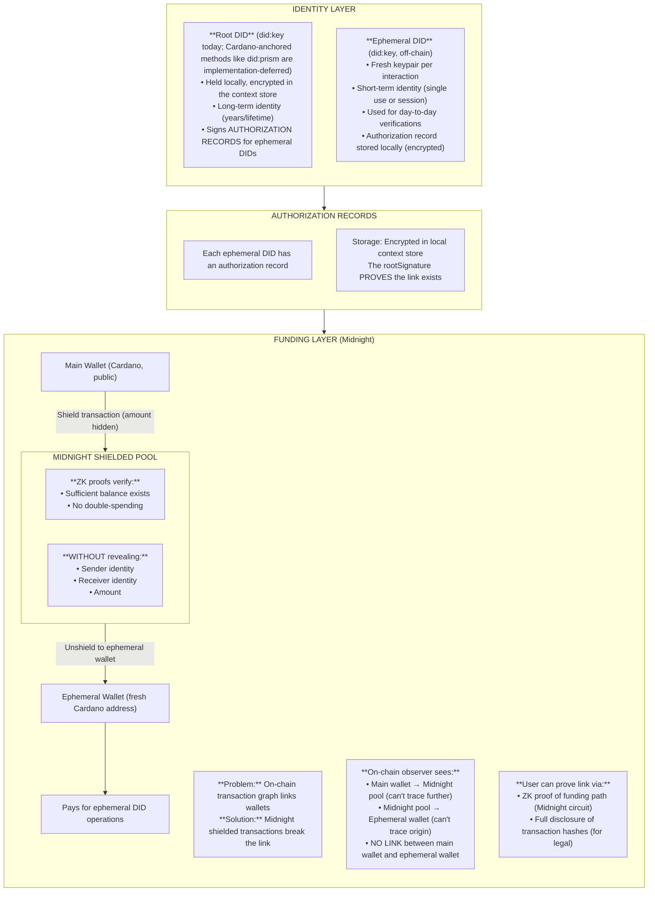

# PCI Identity Privacy Model

**Status:** Approved
**Date:** 2025-12-16

## Core Principle

**Privacy is about controlling *who* can link, not preventing *all* linkage.**

The cryptographic link between Root DID and Ephemeral DIDs MUST exist, but only the user controls when and to whom it is revealed.

## Requirements

### Privacy Requirements
- Third parties CANNOT link ephemeral DIDs to each other
- Third parties CANNOT link ephemeral DIDs to root DID
- On-chain transaction analysis CANNOT reveal identity links
- Timing/metadata analysis CANNOT reveal identity links

### Provability Requirements
- User CAN prove any ephemeral DID belongs to their root DID
- User CAN prove funding source when legally required
- Proofs are cryptographically verifiable
- Authorization records provide audit trail

### Use Cases Requiring Proof
- Legal discovery ("prove you bought X")
- Copyright claims ("prove you created Y")
- Audit trails ("prove employment history")
- Insurance claims ("prove you were the policyholder")
- Inheritance ("prove these assets belong to estate")
- Service continuity ("prove you're same person who did action Y")

## Architecture



**Authorization Record Example:**

```json
{
  "ephemeralDid": "did:key:z6MkhaXgBZDvotDkL5257faiztiGiC2QtKLGpbnnEGta2doK",
  "rootDid": "did:key:z6MkfrQNKB1qGvBALocALKahRwPmZmnwyRRVfEsX8k4B7pNK",
  "purpose": "age_verification",
  "context": {
    "verificationType": "age_over_18",
    "verifierDid": "did:key:z6MkuAn3jnrCbkFYaKfrX7prLrDrEd8jjBt6vh2vDCNjWEuS",
    "policyHash": "0x..."
  },
  "timestamp": "2025-12-16T10:30:00Z",
  "expiresAt": "2025-12-16T11:30:00Z",
  "rootSignature": "0x..."
}
```

## Proof Scenarios

### Scenario 1: Full Disclosure (Legal/Audit)

When legally required to prove ownership:

```
Auditor: "Prove ephemeral DID X belongs to you"

User provides:
1. Root DID (did:key:z6Mk... — held locally, not on-chain)
2. Authorization Record for ephemeral DID X
3. Signs challenge with root private key

Auditor verifies:
✓ Authorization record signature matches root DID public key
✓ Challenge signature proves user controls root DID
✓ Root DID public key matches the one presented (with did:key the identifier is the key itself; if Cardano-anchored methods like did:prism are later adopted, the public record replaces this step)

Result: Cryptographic proof that ephemeral DID X was authorized by user
```

### Scenario 2: ZK Proof (Privacy-Preserving)

When proving relationship without revealing root identity:

```
Service: "Prove you're the same person who did action Y"

User generates ZK proof (via Midnight):
"I know a root DID R such that:
 - R signed authorization for ephemeral DID A (action Y)
 - R signed authorization for ephemeral DID B (current request)
 WITHOUT revealing R"

Result: Proves continuity without revealing identity
```

### Scenario 3: Funding Proof

When required to prove funding source:

```
Investigator: "Prove where ephemeral wallet funds came from"

Option A - Full Disclosure:
User provides Midnight transaction hashes showing path

Option B - ZK Proof:
User generates proof: "Funds originated from wallet I control"
Without revealing which wallet
```

## Security Properties

### What Adversaries CANNOT Do

| Adversary | Cannot |
|-----------|--------|
| Business/Verifier | Link ephemeral DIDs to root or each other |
| Blockchain analyst | Trace funding from main wallet to ephemeral |
| Network observer | Correlate transactions by timing/IP |
| Colluding verifiers | Pool data to identify users |

### What Adversaries CAN Do (Acceptable)

| Adversary | Can |
|-----------|-----|
| Anyone | See that root DID exists on Cardano |
| Anyone | See VCs attached to root DID |
| Verifier | Verify ephemeral DID signature is valid |
| Verifier | Verify ZK proof is valid |

### What User CAN Do

| User | Can |
|------|-----|
| Prove ownership | Of any ephemeral DID to any party |
| Prove funding | Source of any ephemeral wallet |
| Revoke | Ephemeral DID (mark as invalid) |
| Export | Full audit trail for legal discovery |

## Implementation Phases

### Phase 1: Authorization Records (Current Sprint)
- [ ] AuthorizationRecord type definition
- [ ] generateAuthorizedEphemeralDID() function
- [ ] verifyAuthorizationRecord() function
- [ ] Local encrypted storage of records
- [ ] Export functionality for audit

### Phase 2: Cardano-anchored DID method (implementation-deferred)
- [ ] Choose the anchoring method (did:prism or an equivalent W3C-registered method)
- [ ] Root DID anchoring on Cardano
- [ ] VC attachment to root DID
- [ ] DID resolution
- [ ] Key rotation mechanism

### Phase 3: Midnight Shielded Funding
- [ ] Midnight SDK integration
- [ ] Shield/unshield transaction flow
- [ ] Ephemeral wallet creation
- [ ] ZK funding proof generation

### Phase 4: ZK Identity Proofs
- [ ] "Same owner" proof circuit (Midnight Compact)
- [ ] Proof verification in S-PAL contracts
- [ ] Privacy-preserving service continuity

## Relationship to S-PAL

S-PAL policies can specify identity requirements:

```json
{
  "identity_linkage": {
    "ephemeral_required": true,
    "proof_of_root_allowed": false,
    "zk_continuity_allowed": true
  }
}
```

- `ephemeral_required`: Must use ephemeral DID, not root
- `proof_of_root_allowed`: Whether full disclosure is permitted
- `zk_continuity_allowed`: Whether ZK "same person" proofs accepted

## Open Questions

### 1. Authorization Record Storage
**Q:** Should authorization records be stored on-chain (encrypted) for recovery?
**Current answer:** No - local only. User responsible for backup.
**Future consideration:** Optional encrypted backup to user's cloud/community node.

### 2. Ephemeral DID Expiry
**Q:** Should ephemeral DIDs auto-expire?
**Current answer:** Optional `expiresAt` field. Default: no expiry.
**Consideration:** Expired DIDs still valid for historical proof, just can't be used for new signatures.

### 3. Root DID Recovery
**Q:** What if user loses root DID private key?
**Options:**
- Social recovery (threshold of trusted parties)
- Hardware security module backup
- If a Cardano-anchored method (e.g. did:prism) is later adopted, key rotation becomes possible on-chain — but original key loss remains permanent
**Current answer:** User responsibility. Document recovery options for Phase 2.
