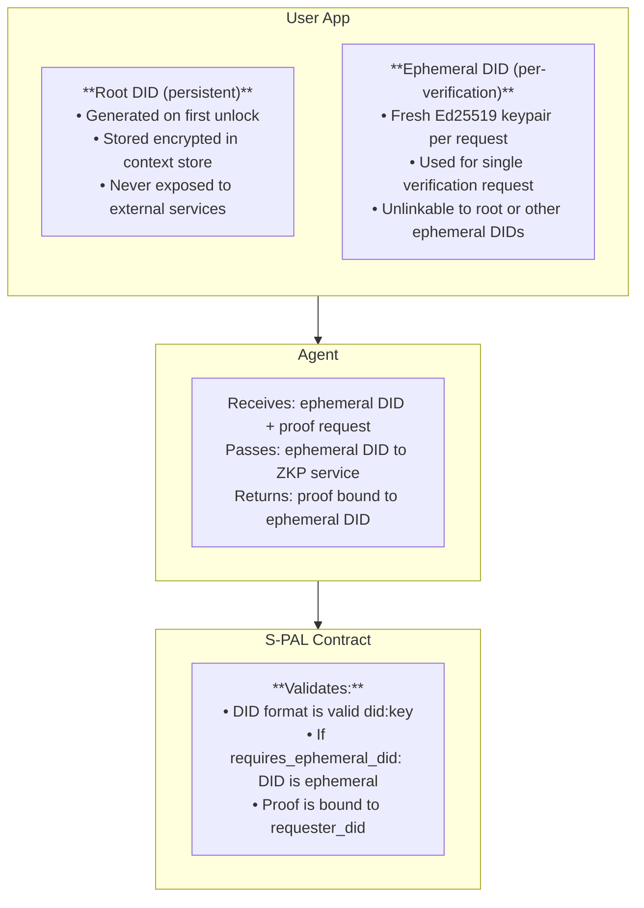
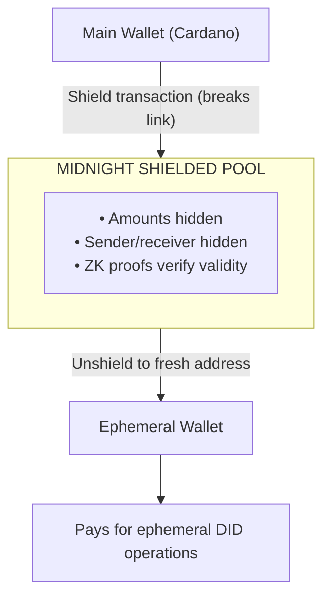

# PCI Identity (`pci-identity`)

**Repository:** `pci-identity`
**Status:** Implementation
**Language:** TypeScript (ESM)

## Overview

The `pci-identity` package provides W3C-compliant Decentralized Identifier (DID) functionality for the PCI ecosystem. It implements the `did:key` method for immediate use and is designed for future migration to `did:prism` for Cardano-anchored identity.

## Core Privacy Principle

> **Privacy is about controlling *who* can link, not preventing *all* linkage.**

The cryptographic link between Root DID and Ephemeral DIDs MUST exist, but only the user controls when and to whom it is revealed.

- **Third parties CANNOT** link ephemeral DIDs to each other or to the root DID
- **User CAN** prove any ephemeral DID belongs to their root (for legal, audit, copyright, etc.)
- **Mechanism:** Authorization records + Midnight shielded funding

## Key Concepts

### Root DID (Persistent Identity)
- Generated once per user, on first unlock
- Stored encrypted in the context store
- Signs authorization records for ephemeral DIDs
- Future: anchored on Cardano via did:prism

### Ephemeral DID (Per-Interaction Identity)
- Generated fresh for each verification request
- Cryptographically unlinkable to root DID by third parties
- User can prove ownership via authorization record when needed
- Bound to ZKP proofs for authenticity

### Authorization Records (Proof of Linkage)
- Created when ephemeral DID is generated
- Signed by root DID private key
- Stored locally (encrypted), never shared with verifiers
- Enables voluntary proof of ownership for:
  - Legal discovery ("prove you bought X")
  - Copyright claims ("prove you created Y")
  - Audit trails ("prove employment history")
  - Insurance/inheritance claims

## DID Format

Using `did:key` method (W3C DID specification):

```
did:key:z6MkhaXgBZDvotDkL5257faiztiGiC2QtKLGpbnnEGta2doK
        │ └─ base58-btc encoded (multicodec + public key)
        └─ 'z' prefix indicates base58-btc encoding
```

Encoding: `MULTIBASE(base58-btc, MULTICODEC(0xed, raw-ed25519-public-key-bytes))`

Where `0xed01` is the multicodec prefix for Ed25519 public keys.

## Architecture



## API Reference

### Core Types

```typescript
/**
 * A DID keypair containing the identifier and key material
 */
interface DIDKeyPair {
  /** The full DID string (e.g., did:key:z6Mk...) */
  did: string;
  /** Raw 32-byte Ed25519 public key */
  publicKey: Uint8Array;
  /** Raw 32-byte Ed25519 private key (seed) */
  privateKey: Uint8Array;
}

/**
 * Serializable format for storing DID in context store
 */
interface SerializedDIDKeyPair {
  did: string;
  publicKey: number[];
  privateKey: number[];
  createdAt: string;
}

/**
 * Context information for an authorization record
 */
interface AuthorizationContext {
  verificationType: string;    // e.g., "age_over_18", "employment_status"
  verifierDid?: string;        // DID of the verifier/business
  policyHash?: string;         // Hash of the S-PAL policy
  metadata?: Record<string, unknown>;
}

/**
 * Authorization record linking an ephemeral DID to a root DID
 * Stored locally (encrypted), enables voluntary proof of ownership
 */
interface AuthorizationRecord {
  ephemeralDid: string;        // The ephemeral DID that was authorized
  rootDid: string;             // The root DID that authorized it
  purpose: string;             // Human-readable purpose
  context: AuthorizationContext;
  timestamp: string;           // ISO 8601
  expiresAt?: string;          // Optional expiry
  rootSignature: Uint8Array;   // Root DID's signature (PROVES THE LINK)
}
```

### Functions

#### `generateDID(): Promise<DIDKeyPair>`

Generate a new `did:key` from a fresh Ed25519 keypair.

```typescript
const rootIdentity = await generateDID();
// rootIdentity.did = "did:key:z6MkhaXgBZDvotDkL5257faiztiGiC2QtKLGpbnnEGta2doK"
```

#### `generateEphemeralDID(): Promise<DIDKeyPair>`

Generate an ephemeral DID that is unlinkable to any other DID. For most use cases, prefer `generateAuthorizedEphemeralDID()` which creates an authorization record.

```typescript
const ephemeral = await generateEphemeralDID();
// Use for single verification request
```

#### `generateAuthorizedEphemeralDID(rootKeyPair, purpose, context, expiresInMs?): Promise<AuthorizedEphemeralDID>`

**Preferred method.** Generate an ephemeral DID with an authorization record that proves root DID ownership when needed.

```typescript
const { ephemeral, authorization } = await generateAuthorizedEphemeralDID(
  rootKeyPair,
  "Age verification at Liquor Store",
  { verificationType: "age_over_18", verifierDid: "did:key:z6Mk..." }
);

// Store authorization record locally (encrypted)
await contextStore.put(`auth:${ephemeral.did}`, serializeAuthorizationRecord(authorization));

// Send only ephemeral.did to verifier - they cannot link to root
```

#### `verifyAuthorizationRecord(record: AuthorizationRecord): Promise<boolean>`

Verify an authorization record is valid. Used when voluntarily proving ownership.

```typescript
// For legal/audit: prove ephemeral DID was yours
const isValid = await verifyAuthorizationRecord(authorization);
// Auditor can verify: signature matches root DID public key
```

#### `isAuthorizationExpired(record: AuthorizationRecord): boolean`

Check if an authorization record has expired.

#### `publicKeyToDID(publicKey: Uint8Array): string`

Convert a raw Ed25519 public key to a `did:key` identifier.

#### `didToPublicKey(did: string): Uint8Array | null`

Extract the raw public key from a `did:key` identifier. Returns `null` for invalid DIDs.

#### `signWithDID(privateKey: Uint8Array, message: Uint8Array): Promise<Uint8Array>`

Sign data with a DID's private key using Ed25519.

#### `verifyDIDSignature(publicKey: Uint8Array, message: Uint8Array, signature: Uint8Array): Promise<boolean>`

Verify a signature against a DID's public key.

#### `isValidDIDKey(did: string): boolean`

Check if a DID is a valid `did:key` format with Ed25519 key.

#### `serializeDIDKeyPair(keyPair: DIDKeyPair): SerializedDIDKeyPair`

Serialize a DID keypair for encrypted storage.

#### `deserializeDIDKeyPair(serialized: SerializedDIDKeyPair): DIDKeyPair`

Deserialize a DID keypair from storage.

#### `truncateDID(did: string, prefixLen?: number, suffixLen?: number): string`

Truncate a DID for display (e.g., `"did:key:z6Mk...xYz"`).

## Dependencies

```json
{
  "@noble/ed25519": "^3.0.0",
  "@scure/base": "^2.0.0"
}
```

These libraries are chosen for:
- **Security**: Audited, production-grade cryptography
- **Browser compatibility**: Pure JavaScript, no native dependencies
- **Size**: Minimal bundle footprint

## Security Considerations

### Private Key Protection
- Root private key is stored encrypted in the context store
- Private keys never leave the user's device
- Ephemeral private keys can be discarded after signing

### Unlinkability (Third Parties)
- Ephemeral DIDs are completely fresh keypairs
- Third parties cannot cryptographically link ephemeral to root
- Transaction graph analysis mitigated via Midnight shielded funding

### Provability (User-Controlled)
- Authorization records provide cryptographic proof of linkage
- Only the user possesses these records (stored locally encrypted)
- User voluntarily reveals proof when needed (legal, audit, copyright)

### Attack Vectors
- **Key extraction**: Mitigated by context store encryption
- **Correlation attacks**: Fresh ephemeral keypairs + Midnight shielding
- **Replay attacks**: Proofs bound to specific DIDs and timestamps
- **Transaction graph analysis**: Midnight shielded pool breaks on-chain links

## Midnight Shielded Funding (Future)

To prevent wallet-based correlation, ephemeral operations use Midnight's privacy layer:



**On-chain observer sees:** Main wallet → Midnight (can't trace further)

**User can prove:** Full funding path via ZK proof or disclosure (for legal/audit)

## Cardano & Midnight Ecosystem Alignment

### did:prism (Future)

[PRISM DID method](https://github.com/input-output-hk/prism-did-method-spec/blob/main/w3c-spec/PRISM-method.md) is W3C compliant and registered in the W3C DID Specification registry.

Format: `did:prism:[64-char-hex-hash]`

Key features:
- Operations anchored on Cardano mainnet via transaction metadata
- Supports Ed25519, secp256k1, X25519 key types
- Full W3C verification relationships (authentication, assertion, key agreement)
- [Atala PRISM](https://atalaprism.io/) provides tooling and enterprise agent

### Midnight Integration

[IAMX is partnering with Midnight](https://midnight.network/blog/state-of-the-network-april-2025) for DID + data protection. Midnight's ZKP capabilities align well with ephemeral DIDs - can prove DID validity without revealing the DID itself.

### Migration Path

1. **Current**: `did:key` for fast iteration (no on-chain anchor needed)
2. **Future**: Migrate to `did:prism` for Cardano-anchored identity

Both methods are W3C compliant and interoperable.

## Usage Examples

### Creating a Root Identity

```typescript
import { generateDID, serializeDIDKeyPair } from '@pci/identity';
import { contextStore } from '@pci/context-store';

// On first user unlock
const rootDID = await generateDID();
await contextStore.put('identity', serializeDIDKeyPair(rootDID));
```

### Verification Flow with Ephemeral DID

```typescript
import { generateEphemeralDID, signWithDID } from '@pci/identity';

// User approves verification request
const ephemeral = await generateEphemeralDID();

// Create signed verification payload
const payload = new TextEncoder().encode(JSON.stringify({
  request_id: requestId,
  timestamp: Date.now(),
  ephemeral_did: ephemeral.did,
}));

const signature = await signWithDID(ephemeral.privateKey, payload);

// Send to agent
await fetch(`${API_URL}/verify`, {
  method: 'POST',
  headers: { 'Content-Type': 'application/json' },
  body: JSON.stringify({
    ephemeral_did: ephemeral.did,
    payload: Array.from(payload),
    signature: Array.from(signature),
  }),
});
```

### Contract Validation (Aiken)

```aiken
fn is_valid_did_key(did: ByteArray) -> Bool {
  // Check starts with "did:key:z" (9 bytes)
  let prefix = #"6469643a6b65793a7a"  // "did:key:z" in hex
  bytearray.take(did, 9) == prefix
}

fn check_ephemeral_did(requester_did: ByteArray, requires_ephemeral: Bool) -> Bool {
  if requires_ephemeral {
    // Ephemeral DIDs must be valid did:key format
    is_valid_did_key(requester_did)
  } else {
    True
  }
}
```

## Related Documentation

- [Identity Privacy Model](identity-privacy-model.md) - Full privacy specification
- [Technical Appendix - DID Section](../architecture/technical-appendix.md#did-implementation)
- [W3C did:key Specification](https://w3c-ccg.github.io/did-key-spec/)
- [PRISM DID Method Spec](https://github.com/input-output-hk/prism-did-method-spec)
