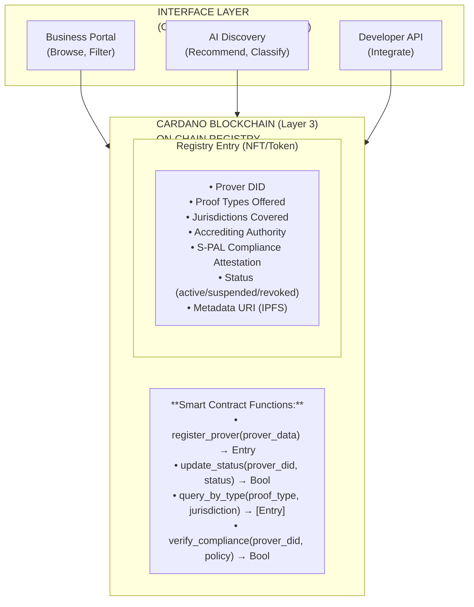
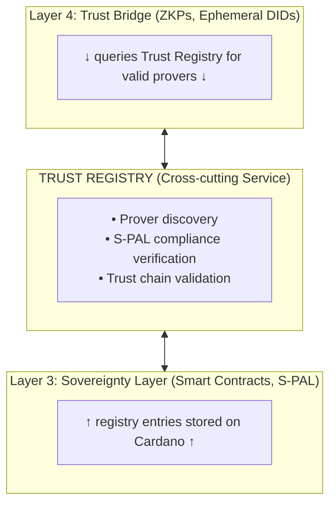

# PCI Trust Registry: The Global Prover Discovery Platform

## Executive Summary

For Personal Context Infrastructure (PCI) to work at scale, businesses need a reliable way to discover and integrate with approved proof providers (provers). Users need confidence that their PCI wallet will work with legitimate verification services. This document proposes the **PCI Trust Registry**—a decentralized, blockchain-anchored registry of approved third-party authorities for providing proofs, with user-friendly discovery platforms built on top.

**The Core Insight:** On-chain = Source of truth. Off-chain platforms = Interface layer.

---

## The Problem: Fragmented Trust

### For Businesses

Today, a business implementing PCI-compatible verification faces significant challenges:

- **Which age verification provider should I use?** Depends on user's country, your country, regulatory requirements
- **How do I know a prover is legitimate?** Manual due diligence for every provider
- **What if regulations change?** No central source of truth for compliance
- **How do I integrate efficiently?** Each prover has different APIs, formats, requirements

### For Users

Users with PCI wallets face parallel challenges:

- **Will this verification work?** No way to know if a prover is trusted before engaging
- **Is this prover S-PAL compliant?** No visibility into whether provers respect Sovereign Privacy & Access Language policies
- **Am I being tracked?** No way to verify provers aren't building shadow profiles

### The Credit Bureau Parallel

Consider how credit scores work today:
- Governments don't run credit bureaus directly
- They authorize private companies (Experian, Equifax, TransUnion) to provide this service
- Businesses integrate with these providers through standardized APIs
- Consumers trust the system because it's regulated and transparent

**PCI needs the same pattern for proof providers.**

---

## Existing Work in This Space

### Standards Bodies (Not Commercial Platforms)

| Initiative | What They Do | Gap |
|-----------|--------------|-----|
| **Trust Over IP (ToIP) TRQP** | Developing Trust Registry Query Protocol—"DNS for trust"—a read-only protocol for querying authoritative trust data | Standards only, no commercial implementation or discovery platform |
| **EU eIDAS 2.0** | Building Trusted Issuer Registries, Trusted Accreditation Registries, and Digital Identity Wallets for Europe | EU-only, government-led, slow to implement |
| **W3C DIDs/VCs** | Standardized formats for decentralized identifiers and verifiable credentials | No discovery mechanism for issuers/verifiers |
| **European Union Trusted Lists (EUTL)** | Public registry of 200+ accredited Trust Service Providers | Limited to EU eIDAS-qualified providers |

### Key Insight from Research

> "Trust registries address a foundational limitation in decentralized identity systems: cryptography alone can't establish trust at scale. While cryptographic proofs confirm that a credential hasn't been altered, they say nothing about whether the issuer is legitimate."
> — Raidiam Developers

The ToIP Foundation is developing a protocol (TRQP) that can answer questions like:
- "Is hospital X authorized to issue health credential Y in ecosystem Z?"
- "Is company X authorized to verify employment credential Y?"

But **no commercial platform exists** to make this accessible to businesses and users.

---

## The PCI Trust Registry Architecture

### Design Philosophy: Anchors to the Chain

Following PCI's core principle—"We don't build ON the chain; we build WITH the chain as an anchor"—the Trust Registry uses:

- **On-chain:** Immutable registry entries (the source of truth)
- **Off-chain:** Discovery platforms, search, AI classification, developer APIs



### On-Chain Registry Data Model

```typescript
interface ProverRegistryEntry {
  // Identity
  prover_did: string;              // Unique DID (e.g., did:key:z6Mk...) — chain-agnostic, matches pci-identity's did:key implementation
  legal_name: string;              // Registered business name
  
  // Capabilities
  proof_types: ProofType[];        // age, identity, credentials, income, etc.
  jurisdictions: Jurisdiction[];   // Countries/regions where authorized
  
  // Trust Chain
  accrediting_authority: {
    type: 'government' | 'delegated' | 'dao';
    did: string;                   // DID of the authority
    attestation_tx: string;        // Transaction ID of attestation
  };
  
  // S-PAL Compliance
  spal_compliance: {
    version: string;               // S-PAL version supported
    attestation_hash: string;      // Hash of compliance audit
    auditor_did: string;           // Who performed the audit
    last_audit: Date;
  };
  
  // Status
  status: 'pending' | 'active' | 'suspended' | 'revoked';
  status_reason?: string;
  
  // Metadata (stored on IPFS, hash on-chain)
  metadata_uri: string;            // ipfs://... with extended info
  
  // Timestamps
  registered: Date;
  last_updated: Date;
}

interface ProofType {
  category: string;                // e.g., "identity", "age", "credentials"
  specific_type: string;           // e.g., "over_18", "over_21", "degree_verified"
  zkp_supported: boolean;
  spal_template_id?: string;       // Recommended S-PAL policy template
}

interface Jurisdiction {
  country_code: string;            // ISO 3166-1 alpha-2
  region?: string;                 // State/province if applicable
  regulatory_framework?: string;   // e.g., "GDPR", "CCPA", "eIDAS"
}
```

### Off-Chain Platform Services

#### 1. Business Portal

A web interface for businesses to:
- **Discover** provers by proof type, jurisdiction, and compliance level
- **Compare** pricing, latency, reliability metrics
- **Integrate** via generated SDK code and API documentation
- **Monitor** prover status changes and compliance updates

#### 2. AI-Powered Discovery

Machine learning layer that:
- **Classifies** provers by industry, use case, and regulatory alignment
- **Recommends** optimal provers based on business requirements
- **Predicts** compliance risks based on regulatory trends
- **Translates** business requirements into technical queries

Example interaction:
```
Business: "I need to verify age for alcohol sales in the UK and Germany"

AI Response:
├── Recommended: Yoti Age Verification (UK primary, DE secondary)
│   ├── S-PAL Compliance: Full
│   ├── Latency: 1.2s average
│   └── Pricing: $0.05/verification
├── Alternative: IDnow (DE primary, UK secondary)
│   ├── S-PAL Compliance: Full
│   └── Pricing: $0.08/verification
└── Integration: [Generate SDK Code] [View API Docs]
```

#### 3. Developer API

RESTful and GraphQL APIs for programmatic access:

```typescript
// Example: Query provers for age verification in UK
const provers = await trustRegistry.query({
  proof_type: 'age.over_18',
  jurisdiction: 'GB',
  spal_compliant: true,
  status: 'active'
});

// Example: Verify a prover's current status
const isValid = await trustRegistry.verify({
  prover_did: 'did:key:z6MkhaXgBZDvotDkL5257faiztiGiC2QtKLGpbnnEGta2doK',
  proof_type: 'age.over_18',
  policy_hash: 'sha256:abc123...'
});
```

---

## Governance: Who Decides Trust?

### Multi-Stakeholder Model

The Trust Registry cannot be controlled by any single entity. We propose a federated governance model:

```mermaid
flowchart TB
    subgraph GovernanceLayers["GOVERNANCE LAYERS"]
        subgraph Layer1["Layer 1: ROOT AUTHORITIES"]
            Gov["Governments<br/>(issue primary authorizations)"]
            Reg["Regulatory Bodies<br/>(sector-specific oversight)"]
            Intl["International Standards Bodies<br/>(cross-border trust)"]
        end

        subgraph Layer2["Layer 2: DELEGATED AUTHORITIES"]
            Industry["Industry Associations<br/>(professional credentials)"]
            Accred["Accreditation Bodies<br/>(audit and certify provers)"]
            Regional["Regional Federations<br/>(local market expertise)"]
        end

        subgraph Layer3["Layer 3: PCI DAO"]
            SPAL["S-PAL Compliance Standards"]
            Tech["Technical Interoperability Requirements"]
            Platform["Platform Governance<br/>(not prover approval)"]
            Dispute["Dispute Resolution"]
        end
    end

    Layer1 --> Layer2
    Layer2 --> Layer3
```



### Trust Chain Verification

When a business or user queries the registry, they can verify the full trust chain:

1. **Prover** → attested by → **Delegated Authority**
2. **Delegated Authority** → authorized by → **Root Authority**
3. **Root Authority** → recognized by → **PCI DAO** (for interoperability)

All attestations are on-chain, cryptographically verifiable, and auditable.

### S-PAL Compliance Certification

For a prover to be listed as "S-PAL Compliant," they must:

1. **Implement S-PAL negotiation protocol** (WebSocket API per spec)
2. **Respect all Non-Negotiables** (ephemeral DIDs, zero retention, no derivatives)
3. **Pass third-party audit** (by accredited auditor)
4. **Maintain audit trail** (queryable by users)
5. **Renew certification annually** (or after significant changes)

---

## Business Model

### Revenue Streams

| Stream | Description | Who Pays |
|--------|-------------|----------|
| **Prover Registration** | Annual listing fee | Provers |
| **Certification Services** | S-PAL compliance audits | Provers |
| **API Access Tiers** | Volume-based pricing | Businesses |
| **Premium Discovery** | AI recommendations, analytics | Businesses |
| **Dispute Resolution** | Mediation services | Disputants |

### Sustainable Economics

Unlike surveillance-based platforms, the Trust Registry has clear value exchange:
- **Provers pay** for visibility and trust signals
- **Businesses pay** for reduced due diligence costs
- **Users benefit** from trusted, S-PAL-compliant verification
- **Community nodes** earn fees for hosting registry infrastructure

---

## Integration with PCI Stack

The Trust Registry adds a **Layer 5** to the PCI architecture—or more precisely, it's a **cross-cutting service** that spans Layers 3 and 4:



### User Journey: Age Verification

1. **User visits alcohol e-commerce site**
2. Site requests age proof via S-PAL negotiation
3. **User's PCI wallet queries Trust Registry:**
   - "Which provers can verify age in my jurisdiction?"
   - "Are they S-PAL compliant?"
4. Wallet presents options to user (or auto-selects based on preferences)
5. User's agent contacts selected prover
6. **Prover verifies** using ZKP (user's birthdate never revealed)
7. **Proof delivered** to site via ephemeral DID
8. **Transaction logged** (proof of verification, not data)

---

## Implementation Roadmap

### Phase 1: Foundation (Months 1-3)
- [ ] On-chain registry smart contract (Cardano)
- [ ] Basic API for prover registration
- [ ] Manual approval process for initial provers
- [ ] Simple query interface

### Phase 2: Discovery Platform (Months 4-6)
- [ ] Business portal (web UI)
- [ ] Developer API (REST + GraphQL)
- [ ] Jurisdiction filtering
- [ ] S-PAL compliance indicators

### Phase 3: AI Layer (Months 7-9)
- [ ] Prover classification ML model
- [ ] Recommendation engine
- [ ] Natural language query interface
- [ ] Regulatory change monitoring

### Phase 4: Federation (Months 10-12)
- [ ] Multi-registry support (connect to EU eIDAS lists, etc.)
- [ ] Cross-chain queries (if provers register on other chains)
- [ ] DAO governance launch
- [ ] Dispute resolution system

---

## Relationship to Similar Projects

### Complementary, Not Competitive

| Project | Relationship |
|---------|-------------|
| **ToIP TRQP** | We implement their protocol; they provide the standard |
| **EU eIDAS Trusted Lists** | We aggregate and make discoverable; they provide authority |
| **W3C VC/DID** | We use their formats; they provide interoperability |
| **Cardano** | We build on their chain; they provide infrastructure |

### Unique Value Proposition

The PCI Trust Registry is unique because it:
1. **Combines standards** (ToIP + eIDAS + W3C) into one queryable platform
2. **Adds S-PAL compliance** as a first-class requirement
3. **Provides AI-powered discovery** for business usability
4. **Operates globally** (not limited to one jurisdiction)
5. **Integrates with PCI wallets** for seamless user experience

---

## Open Questions

1. **Bootstrap Problem:** How do we get the first provers listed before businesses use the registry?
   - *Proposed:* Partner with existing VC/DID-compliant provers who want to signal S-PAL support

2. **Authority Recognition:** Who decides which root authorities are legitimate?
   - *Proposed:* Start with UN-recognized governments and major regulatory bodies; expand via DAO governance

3. **Cross-Border Disputes:** How do we handle conflicts between jurisdictions?
   - *Proposed:* Flag conflicts clearly; let businesses and users make informed decisions

4. **Prover Liability:** What happens if a "certified" prover violates S-PAL?
   - *Proposed:* Bonding/insurance requirements for premium certification tiers

---

## Conclusion

The PCI Trust Registry transforms the fragmented landscape of identity and verification provers into a coherent, queryable, blockchain-anchored system. By separating the source of truth (on-chain) from the discovery layer (off-chain platforms), we enable both cryptographic guarantees and user-friendly experiences.

This is **the most commercially viable piece of the PCI architecture**—businesses need this solved today, and they'll pay for a solution that reduces due diligence costs while ensuring compliance.

---

## References

1. Trust Over IP Foundation. "Trust Registry Query Protocol V2.0." https://trustoverip.github.io/tswg-trust-registry-protocol/

2. EU eIDAS 2.0. "European Digital Identity Framework." Regulation (EU) 2024/1183.

3. Raidiam Developers. "What Is a Trust Registry?" https://www.raidiam.com/developers/blog/trust-registries-in-scalable-digital-trust

4. W3C. "Verifiable Credentials Data Model 1.1." https://www.w3.org/TR/vc-data-model/

5. Credential Engine & Digital Credentials Consortium. "Issuer Identity Registry Research Report." June 2025.

---

*Version 1.0 - December 2025*
*This is a living document. Latest version at https://pci.community/trust-registry*
